# HCS-XX: ZKBC Architecture Diagrams (Companion)

### Status: Draft (companion to [HCS-XX Zero-Knowledge Boundary Compliance](./ZKBC-Zero-Knowledge-Boundary-Compliance.md))

This document is illustrative, not normative. Every diagram is drawn from the
text of the ZKBC draft and links to the section it depicts; where a diagram
exposes an ambiguity that is still open in the draft, the caption points to the
matching entry in the [Architecture Review](./ZKBC-Architecture-Review.md).
Field names, enum values, and hash-preimage orderings are copied verbatim from
the draft so that a reviewer can check each figure against the prose.

Eight diagrams — A1, A3, A5, B1, B2, B4, B7, and C7 — are also embedded in the
draft itself. The draft's copies are canonical; this document mirrors them
byte-for-byte, and a change to one of them belongs in the draft first.

Reading order: **Part A** places the components and trust classes; **Part B**
follows one boundary action from capture to on-graph verification; **Part C**
gives the input/output contract of each policy family, proof mode, wire object,
and topic operation.

Visual convention used throughout: **dashed strokes** mark private-witness
material that never leaves the gateway; solid strokes mark public artifacts.

### Diagram Index

| # | Diagram | Draft section |
|---|---------|---------------|
| A1 | Deployment component overview | [Architecture Overview](./ZKBC-Zero-Knowledge-Boundary-Compliance.md#architecture-overview) |
| A2 | Trust boundaries and threat model | [Security Considerations](./ZKBC-Zero-Knowledge-Boundary-Compliance.md#security-considerations) |
| A3 | Complete mediation: channel × direction | [Complete Mediation](./ZKBC-Zero-Knowledge-Boundary-Compliance.md#complete-mediation) |
| A4 | Deployment profiles | [Deployment Profiles](./ZKBC-Zero-Knowledge-Boundary-Compliance.md#deployment-profiles-informative) |
| A5 | Topic system: types, keys, memos, publishers | [Topic System](./ZKBC-Zero-Knowledge-Boundary-Compliance.md#topic-system) |
| A6 | Standards integration map | [Integration with Existing Standards](./ZKBC-Zero-Knowledge-Boundary-Compliance.md#integration-with-existing-standards) |
| B1 | Lifecycle: topic setup and registration | [Implementation Workflow](./ZKBC-Zero-Knowledge-Boundary-Compliance.md#implementation-workflow) |
| B2 | Gateway two-phase processing | [Gateway Processing Model](./ZKBC-Zero-Knowledge-Boundary-Compliance.md#gateway-processing-model) |
| B3a | Per-action sequence: real-time mode | [Proof Modes](./ZKBC-Zero-Knowledge-Boundary-Compliance.md#proof-modes) |
| B3b | Per-session sequence: batch mode | [Proof Modes](./ZKBC-Zero-Knowledge-Boundary-Compliance.md#proof-modes) |
| B3c | Recursive mode and the chain digest | [Proof Modes](./ZKBC-Zero-Knowledge-Boundary-Compliance.md#proof-modes) |
| B4 | Canonicalization pipelines | [Canonicalization](./ZKBC-Zero-Knowledge-Boundary-Compliance.md#canonicalization) |
| B5 | Commitment constructions | [Commitments and Identifiers](./ZKBC-Zero-Knowledge-Boundary-Compliance.md#commitments-and-identifiers) |
| B6 | Public statement binding | [Public Statement Binding](./ZKBC-Zero-Knowledge-Boundary-Compliance.md#public-statement-binding) |
| B7 | Auditor verification decision flow | [Validation](./ZKBC-Zero-Knowledge-Boundary-Compliance.md#validation) |
| B8 | Policy lifecycle and timestamp-scoped resolution | [`policy_published`](./ZKBC-Zero-Knowledge-Boundary-Compliance.md#policy_published) / [`policy_revoked`](./ZKBC-Zero-Knowledge-Boundary-Compliance.md#policy_revoked) |
| C1 | Output family I/O | [Output Compliance](./ZKBC-Zero-Knowledge-Boundary-Compliance.md#output-compliance) |
| C2 | Tool-invocation family I/O | [Tool-Invocation Compliance](./ZKBC-Zero-Knowledge-Boundary-Compliance.md#tool-invocation-compliance) |
| C3 | Access family I/O | [Access Compliance](./ZKBC-Zero-Knowledge-Boundary-Compliance.md#access-compliance) |
| C4 | Receipt and journal structure | [Public Compliance Journal](./ZKBC-Zero-Knowledge-Boundary-Compliance.md#public-compliance-journal) / [Receipt Wire Format](./ZKBC-Zero-Knowledge-Boundary-Compliance.md#compliance-receipt-wire-format) |
| C5 | Operation envelopes | [Operation Reference](./ZKBC-Zero-Knowledge-Boundary-Compliance.md#operation-reference) |
| C6 | Normalization asymmetry: fail-closed vs fail-open | [Normalization and Confusable Text](./ZKBC-Zero-Knowledge-Boundary-Compliance.md#6-normalization-and-confusable-text) |
| C7 | Proof-mode configuration matrix | [Proof Modes](./ZKBC-Zero-Knowledge-Boundary-Compliance.md#proof-modes) |

---

## Part A — Architecture

### A1. Deployment component overview

The six component classes of the
[Architecture Overview](./ZKBC-Zero-Knowledge-Boundary-Compliance.md#architecture-overview):
host and sandbox, gateways, the two issuer registries, the receipt topics (one
per gateway or one shared), HCS-1 proof storage, and the HCS-11 profile. The
host also runs the per-session sequence counter every gateway draws from. The
agent has no edge to anything outside the sandbox except through a gateway.
Solid on-graph edges carry the operation or artifact named on them; dotted
edges are off-graph distribution or discovery.

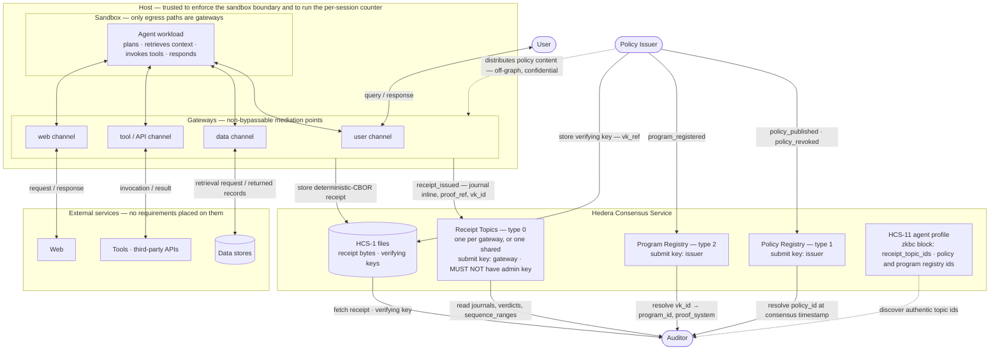

### A2. Trust boundaries and threat model

The trust class of each principal, from the threat model in
[Security Considerations](./ZKBC-Zero-Knowledge-Boundary-Compliance.md#security-considerations).
The host is the only *trusted* party, and only for one thing: keeping every
egress path inside a gateway. That property is checked by deployment audit; the
proof system cannot establish it, and hardware attestation of the gateway
software is out of scope for this version of the draft.

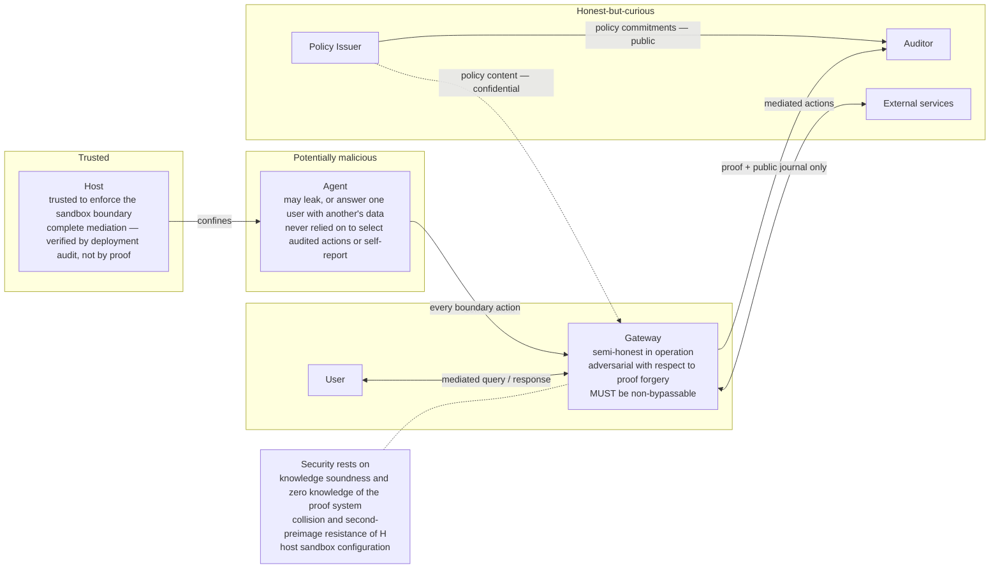

### A3. Complete mediation: channel × direction

[Complete Mediation](./ZKBC-Zero-Knowledge-Boundary-Compliance.md#complete-mediation)
requires a gateway on every channel and in both directions; the action record's
`channel` enum is `{ user, data, tool, web }` and `direction` is
`{ inbound, outbound }` relative to the agent. The dotted, crossed edge is the
path the sandbox MUST deny. Web requests are evaluated under the tool family,
with the request target's scheme and host as the tool identifier.

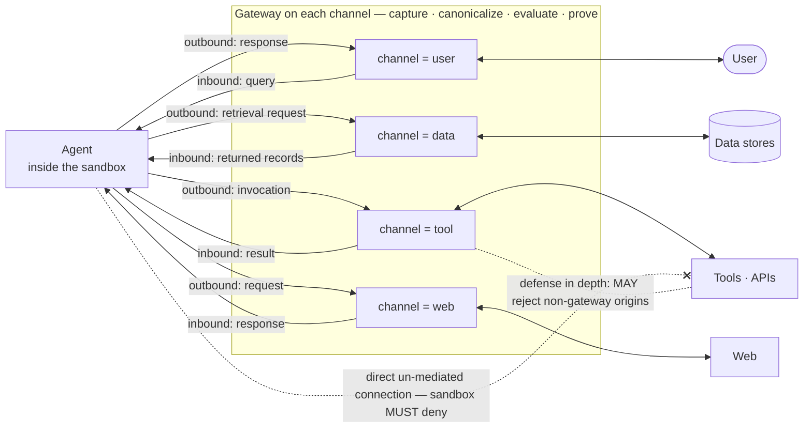

### A4. Deployment profiles

The three informative profiles of
[Deployment Profiles](./ZKBC-Zero-Knowledge-Boundary-Compliance.md#deployment-profiles-informative)
use the same vocabulary as A1; only *who operates the host* and *where receipts
go* change. The cryptographic layer is identical in all three. The Local
profile MAY keep receipts off-graph, which makes it a partial-conformance
configuration (on-graph anchoring is REQUIRED for full HCS-XX conformance).

```mermaid
flowchart TB
  subgraph Local["Local profile — the user's device is the host"]
    direction LR
    LH["Host = user device"]
    LS["Sandbox: assistant"]
    LG["Gateway<br/>mediates local files · memory · browser · network"]
    LR["Receipts MAY stay off-graph<br/>crypto layer verifies unchanged"]
    LH --> LS --> LG --> LR
  end

  subgraph Enterprise["Enterprise profile — organization-operated hosts"]
    direction LR
    EH["Org hosts"]
    ES["Sandboxed agent workloads"]
    EG["Gateway per sandbox boundary<br/>organizational policy"]
    EX["Tenant-scoped data stores · internal tools · external connectors"]
    ER["Receipt topics on-graph"]
    EH --> ES --> EG --> EX
    EG --> ER
  end

  subgraph Platform["Platform profile — sandbox and gateway built into the runtime"]
    direction LR
    PH["Platform hosts"]
    PS["Agent runtime with embedded sandbox + gateway"]
    PV["Verification artifacts exposed to<br/>customers · auditors · regulators"]
    PR["Receipt topics on-graph"]
    PH --> PS --> PR --> PV
  end
```

### A5. Topic system: types, keys, memos, publishers

The three topic types of the
[Topic System](./ZKBC-Zero-Knowledge-Boundary-Compliance.md#topic-system),
their memos (`hcs-xx:<indexed>:<ttl>:<type>[:<param>]`, always `indexed = 0`),
the key discipline, and the transaction memo `hcs-xx:op:{op}:{type}` on each
operation. Values are the draft's test-vector identifiers. The receipt-topic
memo names its policy registry and `policy_published` names the program
registry, so both registries are reachable from a receipt topic alone.

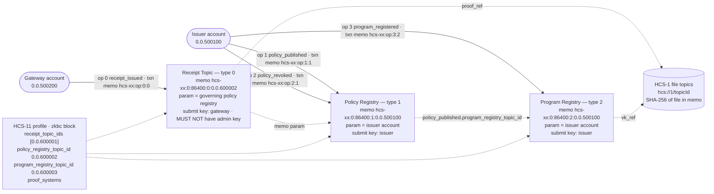

### A6. Standards integration map

How ZKBC composes with the rest of the HCS family, per
[Integration with Existing Standards](./ZKBC-Zero-Knowledge-Boundary-Compliance.md#integration-with-existing-standards)
and the [Rationale](./ZKBC-Zero-Knowledge-Boundary-Compliance.md#rationale).

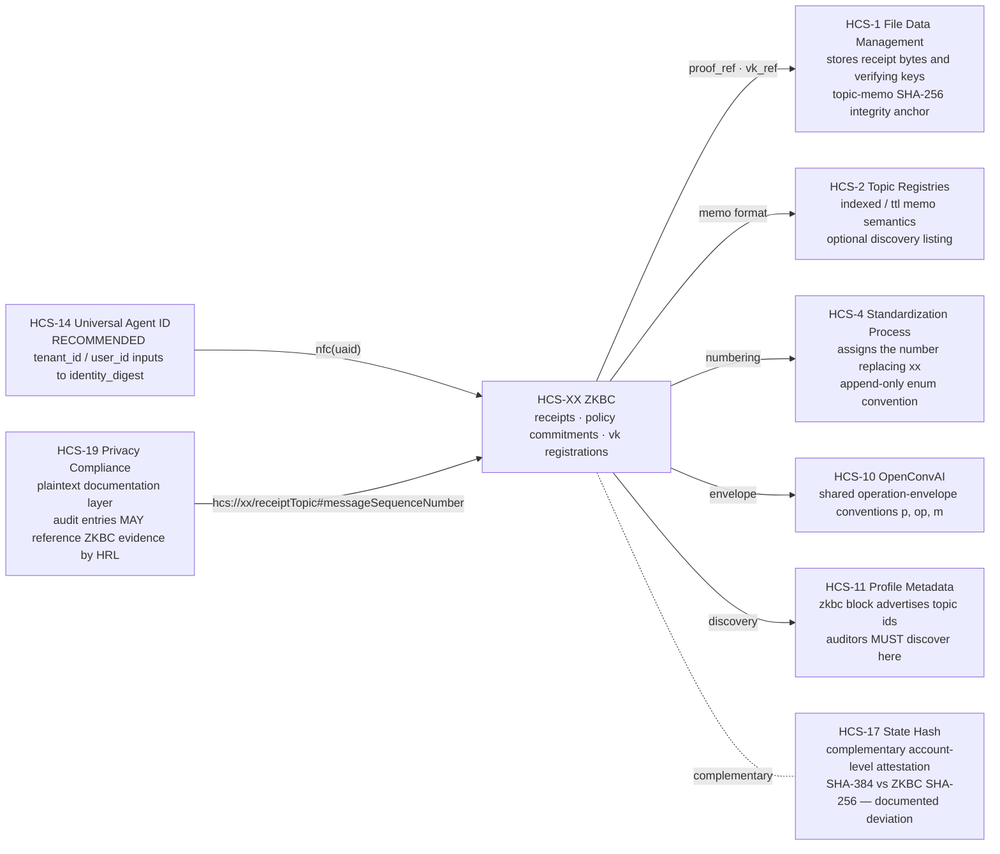

---

## Part B — Data Flow

### B1. Lifecycle: topic setup and registration (Workflow Steps 1–2)

[Implementation Workflow](./ZKBC-Zero-Knowledge-Boundary-Compliance.md#implementation-workflow)
Steps 1 and 2. Everything here happens once per deployment or per policy
version, before any boundary action is mediated. `program_id` is
`commit(nfc("program"), program_descriptor)`; `vk_id` MUST be
`commit(nfc("vk"), vk_bytes)` over the bytes at the REQUIRED `vk_ref`, so a
fetched key is self-authenticating.

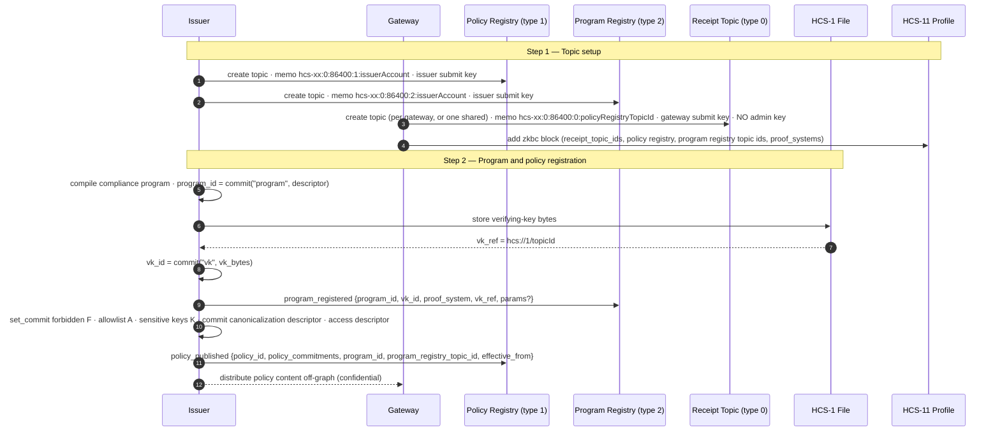

### B2. Gateway two-phase processing (per boundary action)

The [Gateway Processing Model](./ZKBC-Zero-Knowledge-Boundary-Compliance.md#gateway-processing-model)
and Workflow Step 3. Phase 1 runs in the clear and gates release; Phase 2 runs
only after Phase 1 passes. Release ordering is mode-dependent: `real_time`
proves before release, `batch` and `recursive` release after the pre-check and
prove at window end. The sequence number is assigned only once the pre-check
passes, so a rejected action leaves no public trace. In `real_time` a proving
failure is fail-closed: the action is held, not released, and the gateway
signals `prover_unavailable`, distinct from `policy_rejected`. The private witness
(dashed) never leaves the gateway; only the receipt and the `receipt_issued`
operation are public.

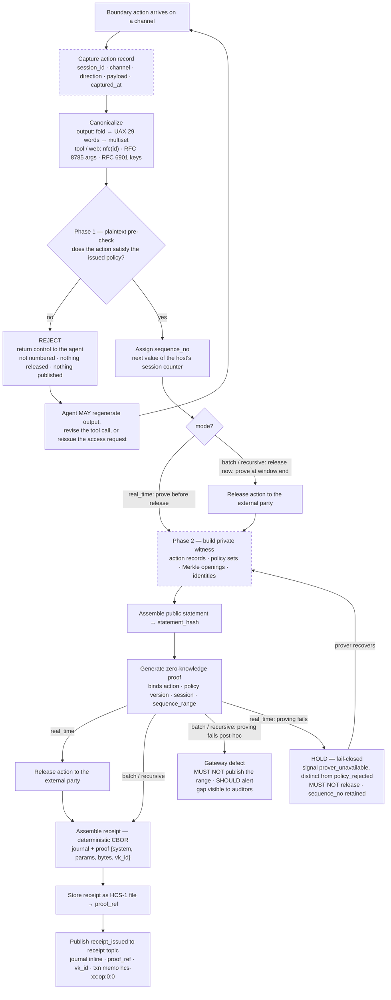

### B3a. Per-action sequence — real-time mode

[Proof Modes](./ZKBC-Zero-Knowledge-Boundary-Compliance.md#proof-modes),
`real_time` (`0x02`): one proof per boundary action, generated on the release
path before the action is released, over `sequence_range = { n, n }`. The mode
is fail-closed: no proof, no release. Prover latency SHOULD be low enough for
interactive use.

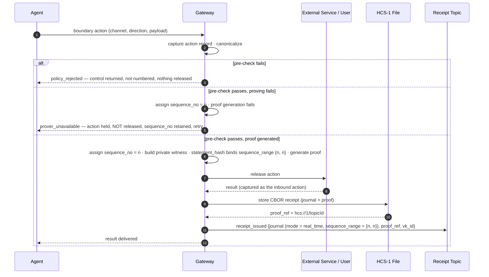

### B3b. Per-session sequence — batch mode

`batch` (`0x01`, post-hoc): actions are pre-checked, numbered, and released as
they occur; one proof later covers the contiguous `sequence_no` range named by
the journal's `sequence_range`, which is bound into `statement_hash`. A proving
failure after release is a gateway defect: nothing is published for the range
and the gap shows up in the auditor's coverage check.

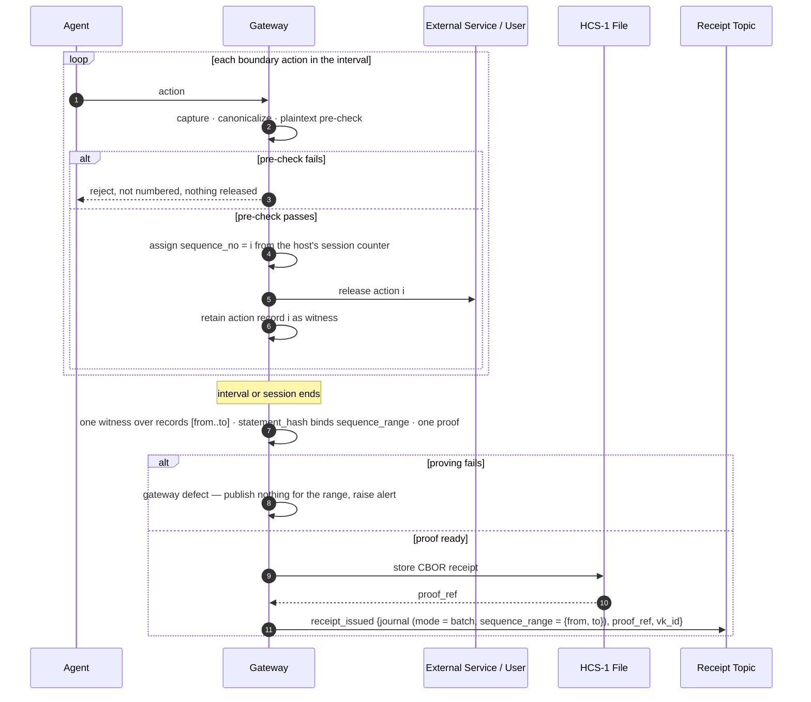

### B3c. Recursive mode and the chain digest

`recursive` (`0x03`): per-action proofs are aggregated into a constant-size
cumulative receipt; each step extends a public chain digest. The journal carries
`chain_digest` and `prev_chain_digest` (REQUIRED in this mode). Each
`statement_hash` binds `prev_chain_digest`; `chain_digest` is then derived from
that `statement_hash`, so it is not itself in the preimage
([R-16](./ZKBC-Architecture-Review.md#r-16)). The verifier recomputes
`chain_digest` and checks that `prev_chain_digest` is empty at genesis or equals
the `chain_digest` of the preceding recursive receipt on the same topic and
session. Per-action proving is off the release path, as in `batch`. A receipt is published at the end of each window (which MAY be a
single step); its `sequence_range` names the steps folded in since the previous
receipt, so the per-receipt step count is public.

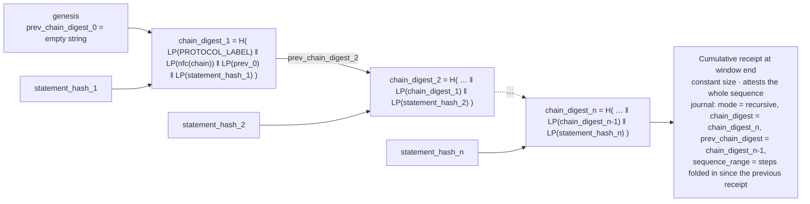

### B4. Canonicalization pipelines

[Canonicalization](./ZKBC-Zero-Knowledge-Boundary-Compliance.md#canonicalization)
uses two deliberately different text forms: `fold` (NFKC + default case
folding + UTF-8) for output tokens matched against the forbidden set, and `nfc`
(NFC + UTF-8) for tool identifiers matched against the allowlist. The pinned
Unicode version, forms, and tokenizer are serialized as an RFC 8785 descriptor
and committed as `output.canonicalization`, so every verifier reproduces the
same public statement.

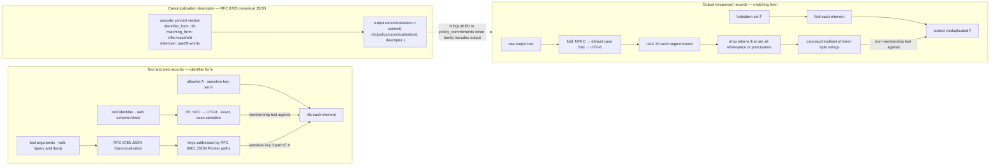

### B5. Commitment constructions

The hash constructions of
[Commitments and Identifiers](./ZKBC-Zero-Knowledge-Boundary-Compliance.md#commitments-and-identifiers)
and [Notation and Primitives](./ZKBC-Zero-Knowledge-Boundary-Compliance.md#notation-and-primitives).
Every variable-length field is length-prefixed (`LP(x) = uint64be(len(x)) ‖ x`)
and every commitment is domain-separated by `PROTOCOL_LABEL = nfc("ZKBC/v1")`
and a purpose tag. Merkle leaves and nodes carry `0x00` / `0x01` prefixes
(RFC 6962 §2.1).

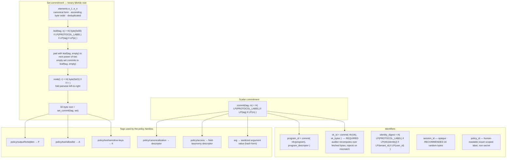

### B6. Public statement binding

[Public Statement Binding](./ZKBC-Zero-Knowledge-Boundary-Compliance.md#public-statement-binding):
the journal fields are serialized in the exact order shown, hashed, and the
result is both the journal's `statement_hash` and the proof's public input. Any
edit to a bound journal field changes the hash and breaks verification. Three
journal fields are *not* in the preimage — `issued_at` (advisory; consensus
timestamp is authoritative), `proof_system` (bound indirectly through
`vk_id → program_registered`), and `chain_digest` (derived from
`statement_hash`, so binding it would be circular) — see
[R-12](./ZKBC-Architecture-Review.md#r-12) and
[R-16](./ZKBC-Architecture-Review.md#r-16).

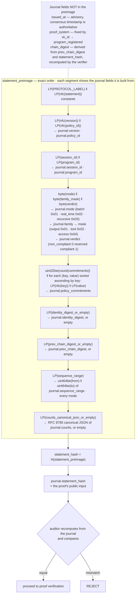

### B7. Auditor verification decision flow

The ordered rules of
[Validation](./ZKBC-Zero-Knowledge-Boundary-Compliance.md#validation) and the
walk-through in
[Example 3](./ZKBC-Zero-Knowledge-Boundary-Compliance.md#example-3-auditor-verification-walk-through).
An *ignored* message is treated as absent, never as evidence of
non-compliance; a *rejected* `receipt_issued` fails as compliance evidence; the
coverage check runs over the accepted receipts of a session across every topic
in `receipt_topic_ids` and qualifies the session, not any single receipt.
Consensus timestamps, not `issued_at`, drive policy resolution.

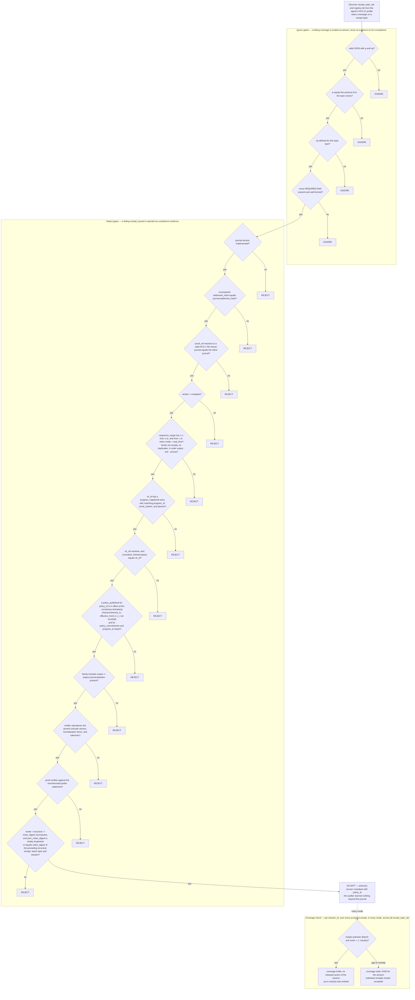

### B8. Policy lifecycle and timestamp-scoped resolution

[`policy_published`](./ZKBC-Zero-Knowledge-Boundary-Compliance.md#policy_published)
and [`policy_revoked`](./ZKBC-Zero-Knowledge-Boundary-Compliance.md#policy_revoked)
on the policy registry, and how an auditor resolves a receipt's `policy_id`
under the single in-effect rule
([R-09](./ZKBC-Architecture-Review.md#r-09)): only consensus time enters it,
and an asserted `effective_from` or `revoked_from` cannot reach back before its
own publication.

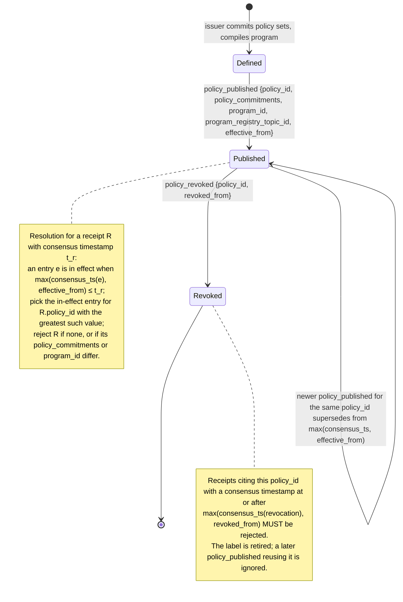

---

## Part C — Input / Output by Use Case and Configuration

Each family separates a **public statement** (what the auditor learns) from a
**private witness** (what stays inside the gateway). The families are
orthogonal and MAY be proved separately or as one conjunctive statement; the
journal's `family` array and the `family_mask` byte record which are covered.

### C1. Output family I/O

[Output Compliance](./ZKBC-Zero-Knowledge-Boundary-Compliance.md#output-compliance):
every token of the canonical output multiset is a non-member of the forbidden
set `F`. This is a *non-membership* relation, so a normalization gap fails
open — see C6 for the consequence.

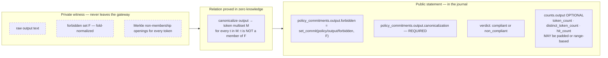

### C2. Tool-invocation family I/O

[Tool-Invocation Compliance](./ZKBC-Zero-Knowledge-Boundary-Compliance.md#tool-invocation-compliance):
authorization (identifier ∈ allowlist `A`) plus argument sanitization (every
key in the sensitive-key set `K` crosses the boundary only in an approved form
from `{ mask, redact, hash }`). Both are *membership* relations and fail
closed.

```mermaid
flowchart LR
  subgraph W["Private witness — never leaves the gateway"]
    direction TB
    w1["tool identifier and arguments — RFC 8785 serialized"]
    w2["allowlist A — nfc-normalized"]
    w3["sensitive-key set K — nfc-normalized, RFC 6901 paths"]
    w4["sanitization outcomes per sensitive key"]
    w5["Merkle membership openings"]
  end

  subgraph Rl["Relations proved in zero knowledge"]
    direction TB
    r1["Authorization: nfc(tool id) is a member of A"]
    r2["Sanitization: for every argument key path in K,<br/>the value crosses the boundary only as<br/>mask → policy sentinel · redact → key omitted · hash → commit(nfc(arg), value)"]
  end

  subgraph Pub["Public statement — in the journal"]
    direction TB
    c1["policy_commitments.tool.allowlist = set_commit(policy/tool/allowlist, A)"]
    c2["policy_commitments.tool.sensitive-keys = set_commit(policy/tool/sensitive-keys, K)"]
    c3["verdict"]
    c4["counts.tool OPTIONAL<br/>invocation_count · argument_count · sensitive_argument_count"]
  end

  subgraph Out["What crosses the boundary to the external service"]
    o1["invocation with sensitive values masked, redacted, or hashed"]
  end

  W --> Rl --> Pub
  Rl --> Out
  classDef witness stroke-dasharray: 5 5;
  class w1,w2,w3,w4,w5 witness;
```

### C3. Access family I/O

[Access Compliance](./ZKBC-Zero-Knowledge-Boundary-Compliance.md#access-compliance):
every observed tenant-context value equals the requesting `tenant_id`, every
observed user-context value equals the requesting `user_id` (from which context
consistency follows), and the decision is bound to the one-way
`identity_digest`. With HCS-14, `tenant_id` and `user_id` are `nfc(uaid)`.

```mermaid
flowchart LR
  subgraph W["Private witness — never leaves the gateway"]
    direction TB
    w1["tenant_id — e.g. nfc(uaid)"]
    w2["user_id — e.g. nfc(uaid)"]
    w3["observed context values across captured data accesses"]
  end

  subgraph Rl["Relations proved in zero knowledge"]
    direction TB
    r0["Identity match: every observed tenant-context value = tenant_id<br/>and every observed user-context value = user_id of the requesting principal"]
    r1["Context consistency (consequence): all tenant-context fields agree<br/>and all user-context fields agree"]
    r2["Private-identity binding: decision bound to<br/>identity_digest = H( LP(label) ‖ LP(nfc(identity)) ‖ LP(tenant_id) ‖ LP(user_id) )"]
  end

  subgraph Pub["Public statement — in the journal"]
    direction TB
    c1["identity_digest — REQUIRED when family includes access"]
    c2["policy_commitments.access = commit(nfc(policy/access), field-taxonomy descriptor)"]
    c3["verdict"]
    c4["counts.access OPTIONAL<br/>context_field_count"]
  end

  W --> Rl --> Pub
  classDef witness stroke-dasharray: 5 5;
  class w1,w2,w3 witness;
```

### C4. Receipt and journal structure

The [Public Compliance Journal](./ZKBC-Zero-Knowledge-Boundary-Compliance.md#public-compliance-journal)
(sixteen fields; twelve REQUIRED, four conditional or optional) and the
[Compliance Receipt Wire Format](./ZKBC-Zero-Knowledge-Boundary-Compliance.md#compliance-receipt-wire-format)
(deterministic CBOR, RFC 8949 §4.2; media type `application/zkbc-receipt+cbor`).
Invariants: `proof.system` MUST equal `journal.proof_system`;
`identity_digest` is REQUIRED iff `family` includes `access`; `chain_digest`
and `prev_chain_digest` are REQUIRED iff `mode = recursive`; `sequence_range`
is REQUIRED in every mode, with `from = to` in `real_time`; `family` is listed
in the order `output`, `tool`, `access`; `verdict` is always `compliant`
in this version (`non_compliant` is reserved); `output.canonicalization` MUST
be present iff `family` includes `output`.

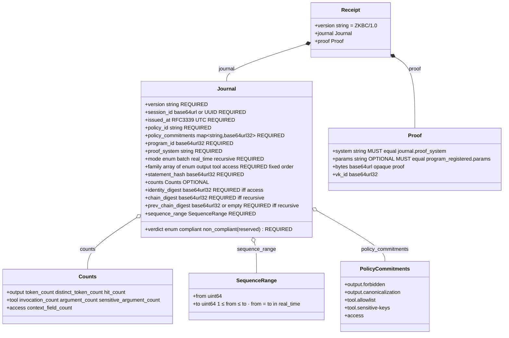

### C5. Operation envelopes

The four operations of the
[Operation Reference](./ZKBC-Zero-Knowledge-Boundary-Compliance.md#operation-reference),
each a JSON message with `p = "hcs-xx"` and `op`, the topic type it is valid
on, and its transaction memo. The consensus timestamp is the authoritative
publication time of every operation.

```mermaid
classDiagram
  class receipt_issued {
    op enum 0 · topic type 0 · txn memo hcs-xx:op:0:0
    +p string hcs-xx
    +op string receipt_issued
    +account_id string gateway
    +journal Journal inline
    +proof_ref string HRL hcs://1/topicId
    +vk_id base64url32 MUST equal receipt.proof.vk_id
    +m string OPTIONAL memo
  }
  class policy_published {
    op enum 1 · topic type 1 · txn memo hcs-xx:op:1:1
    +p string hcs-xx
    +op string policy_published
    +account_id string issuer
    +policy_id string
    +policy_commitments map
    +program_id base64url32
    +program_registry_topic_id string
    +effective_from RFC3339 UTC
    +m string OPTIONAL
  }
  class policy_revoked {
    op enum 2 · topic type 1 · txn memo hcs-xx:op:2:1
    +p string hcs-xx
    +op string policy_revoked
    +account_id string issuer
    +policy_id string
    +revoked_from RFC3339 UTC
    +m string OPTIONAL
  }
  class program_registered {
    op enum 3 · topic type 2 · txn memo hcs-xx:op:3:2
    +p string hcs-xx
    +op string program_registered
    +account_id string issuer
    +program_id base64url32
    +vk_id base64url32 commits to bytes at vk_ref
    +proof_system string
    +params string OPTIONAL
    +vk_ref string HRL REQUIRED
    +m string OPTIONAL
  }
  class ReceiptTopic {
    type 0 · submit key gateway · no admin key
  }
  class PolicyRegistry {
    type 1 · submit key issuer
  }
  class ProgramRegistry {
    type 2 · submit key issuer
  }
  ReceiptTopic <.. receipt_issued : published by gateway
  PolicyRegistry <.. policy_published : published by issuer
  PolicyRegistry <.. policy_revoked : published by issuer
  ProgramRegistry <.. program_registered : published by issuer
  receipt_issued ..> program_registered : vk_id resolves to program_id
  receipt_issued ..> policy_published : policy_id resolves at consensus timestamp
  policy_published ..> ProgramRegistry : program_registry_topic_id
```

### C6. Normalization asymmetry: fail-closed vs fail-open

Why the draft uses two text forms
([Canonicalization](./ZKBC-Zero-Knowledge-Boundary-Compliance.md#canonicalization)
rationale and
[Normalization and Confusable Text](./ZKBC-Zero-Knowledge-Boundary-Compliance.md#6-normalization-and-confusable-text)),
with the draft's own `ssn` vectors. Homoglyphs across scripts are an
acknowledged residual risk: output compliance is best-effort against an
adversarial agent and sound only against an honest-but-imprecise one.

```mermaid
flowchart LR
  subgraph Tool["Tool allowlist — MEMBERSHIP relation — nfc"]
    direction TB
    t0["identifier as written"] --> t1{"nfc form ∈ A?"}
    t1 -->|"yes"| t2["authorized"]
    t1 -->|"no — including any normalization gap"| t3["rejected → FAIL CLOSED (safe)"]
    t4["an over-aggressive form would map distinct ids onto an allowlisted one → widens authorization"]
  end

  subgraph Outp["Forbidden set — NON-MEMBERSHIP relation — fold"]
    direction TB
    o0["token as written"] --> o1{"fold form ∈ F?"}
    o1 -->|"yes"| o2["pre-check rejects → policy_rejected"]
    o1 -->|"no — including any normalization gap"| o3["released → FAIL OPEN (unsafe)"]
    o4["hence the most aggressive form: NFKC + case fold"]
  end

  subgraph Vec["Test vectors with F = { ssn }"]
    direction TB
    v1["ssn → fold ssn → member → pre-check rejects"]
    v2["SSN → fold ssn → member → pre-check rejects"]
    v3["ｓｓｎ fullwidth → fold ssn → member → pre-check rejects"]
    v4["ѕѕn Cyrillic → fold ѕѕn → NOT member → compliant<br/>homoglyph: residual risk, NOT mitigated"]
    v5["Mitigation options: constrain output script or repertoire at the gateway,<br/>or apply UTS 39 confusable skeletons to tokens and F"]
  end
```

### C7. Proof-mode configuration matrix

The three [Proof Modes](./ZKBC-Zero-Knowledge-Boundary-Compliance.md#proof-modes);
an implementation MUST support at least one and records the selected mode in
the journal.

| Mode | Byte | Coverage unit | Proved vs released | Extra journal fields | Extra verifier checks | Suited to |
|------|------|---------------|--------------------|----------------------|-----------------------|-----------|
| `batch` | `0x01` | many actions over a contiguous `sequence_no` range | released after pre-check; proved post-hoc | none | none | periodic audit, latency uncritical |
| `real_time` | `0x02` | one boundary action (`from = to`) | proved on the release path, before release; fail-closed | none | `from = to` | interactive use |
| `recursive` | `0x03` | cumulative sequence, constant-size receipt; one receipt per window | released after pre-check; per-action proofs aggregated step by step, off the release path | `chain_digest`, `prev_chain_digest` | chain-digest recurrence to the preceding receipt on the same topic and session | long-running sessions, compact evidence |

`sequence_range` is REQUIRED in every mode and the session coverage check
applies to every mode; a session MAY mix modes.

```mermaid
flowchart LR
  subgraph B["batch 0x01"]
    direction LR
    b1["a_from"] --- b2["a_from+1"] --- b3["…"] --- b4["a_to"]
    b5["one proof · one receipt<br/>sequence_range = [from, to]"]
    b4 --> b5
  end
  subgraph R["real_time 0x02"]
    direction LR
    r1["a_i"] --> r2["proof_i · receipt_i<br/>before release · fail-closed<br/>sequence_range = [i, i]"]
  end
  subgraph C["recursive 0x03"]
    direction LR
    c1["a_1 → proof_1"] --> c2["a_2 → proof_2 folds in proof_1"] --> c3["… → cumulative receipt at window end<br/>chain_digest extends each step · sequence_range = window"]
  end
```

---

## License

This document is licensed under Apache-2.0.
