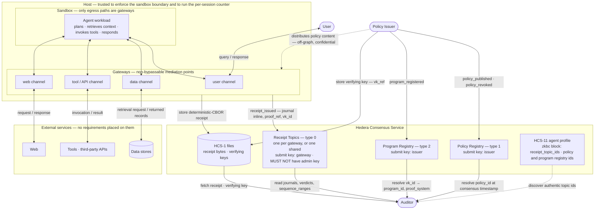
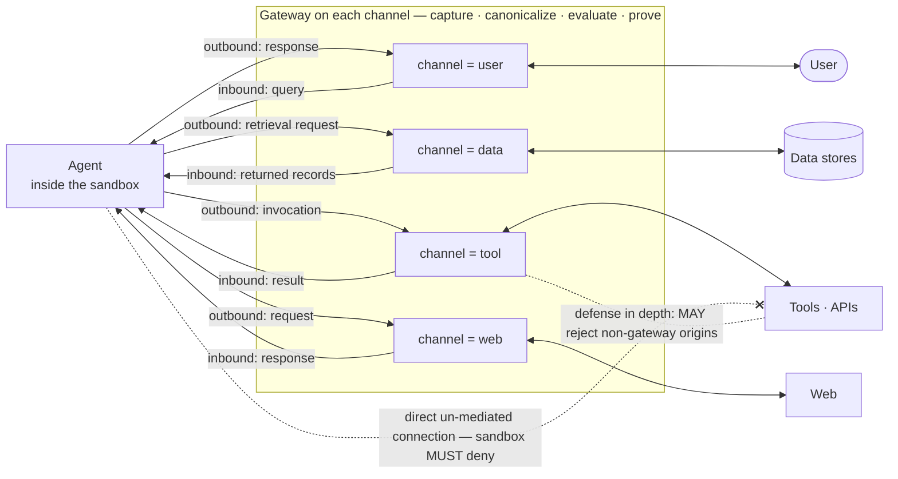
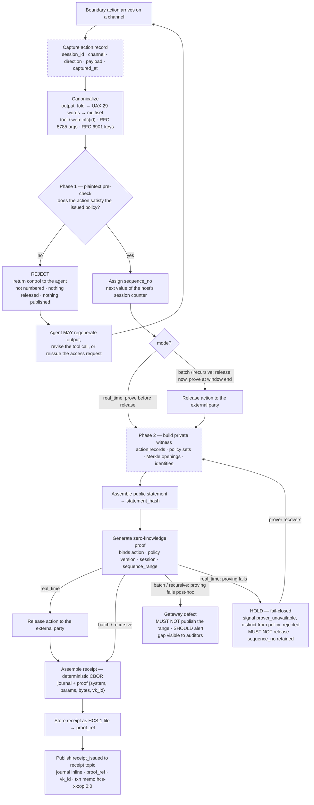
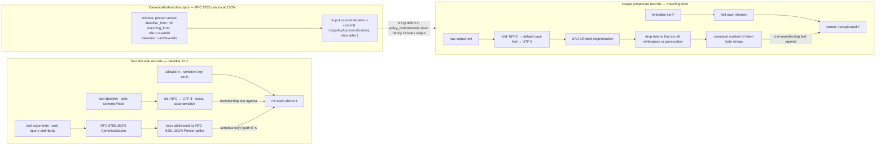
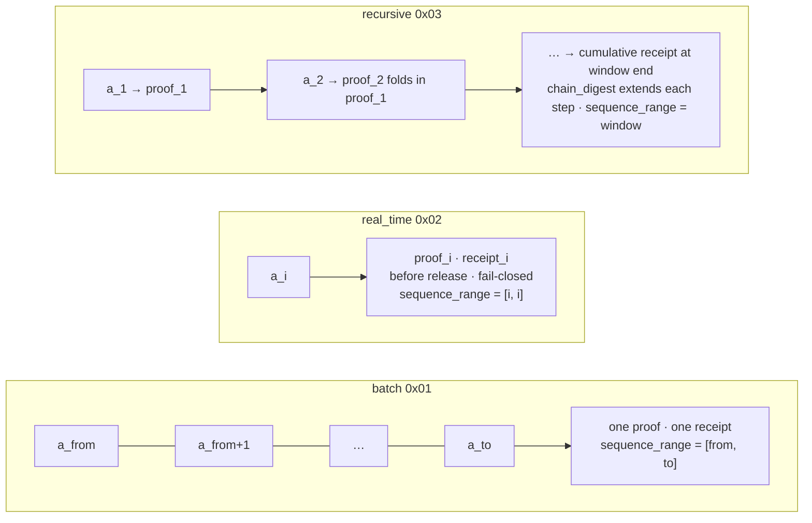
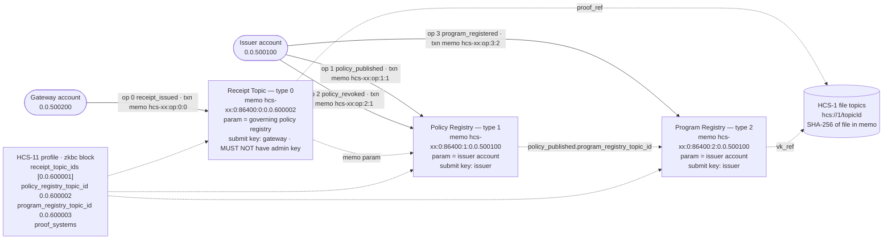
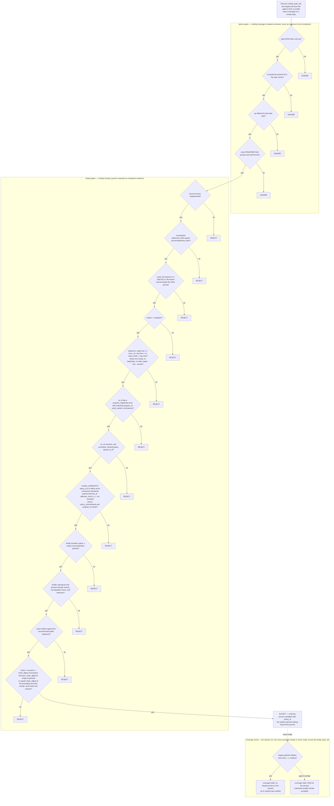
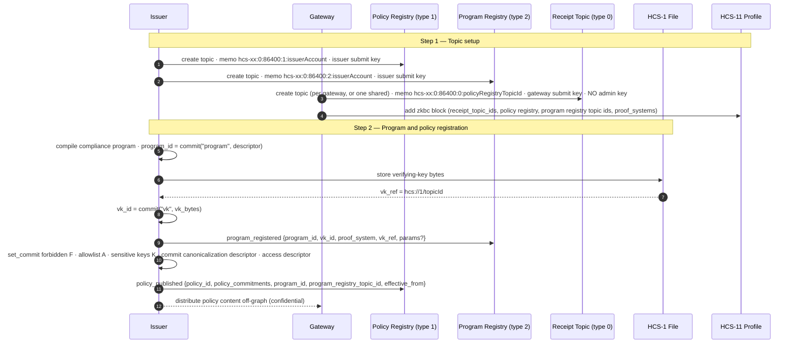

# HCS-XX Standard: Zero-Knowledge Boundary Compliance for Autonomous Agents

### Status: Draft

### Version: 1.0

Discussion: (URL to GitHub Discussion)

### Table of Contents

- [Authors](#authors)
- [Abstract](#abstract)
- [Motivation](#motivation)
- [Specification](#specification)
  - [Terminology and Roles](#terminology-and-roles)
  - [Notation and Primitives](#notation-and-primitives)
  - [Architecture Overview](#architecture-overview)
    - [Complete Mediation](#complete-mediation)
    - [Boundary Action Capture](#boundary-action-capture)
    - [Gateway Processing Model](#gateway-processing-model)
  - [Canonicalization](#canonicalization)
  - [Commitments and Identifiers](#commitments-and-identifiers)
  - [Compliance Policy Families](#compliance-policy-families)
  - [Public Statement Binding](#public-statement-binding)
  - [Proof-System Requirements](#proof-system-requirements)
  - [Public Compliance Journal](#public-compliance-journal)
  - [Compliance Receipt Wire Format](#compliance-receipt-wire-format)
  - [Proof Modes](#proof-modes)
  - [Topic System](#topic-system)
    - [Topic Types and Enums](#topic-types-and-enums)
    - [Topic Memo Formats](#topic-memo-formats)
    - [Transaction Memos for Analytics](#transaction-memos-for-analytics)
  - [Operation Reference](#operation-reference)
    - [`receipt_issued`](#receipt_issued)
    - [`policy_published`](#policy_published)
    - [`policy_revoked`](#policy_revoked)
    - [`program_registered`](#program_registered)
  - [Validation](#validation)
  - [Integration with Existing Standards](#integration-with-existing-standards)
  - [Implementation Workflow](#implementation-workflow)
- [Rationale](#rationale)
- [Backwards Compatibility](#backwards-compatibility)
- [Security Considerations](#security-considerations)
- [Privacy Considerations](#privacy-considerations)
- [Test Vectors](#test-vectors)
- [Examples](#examples)
- [Conformance](#conformance)
  - [Relationship to Record-Keeping Obligations](#relationship-to-record-keeping-obligations)
- [References](#references)
- [Conclusion](#conclusion)
- [Governance Record (fill at publication)](#governance-record-fill-at-publication)
- [License](#license)

## Authors

- <name> (<github handle>)

## Abstract

This document specifies an open, vendor-neutral architecture and conformance
requirements for verifiable, privacy-preserving compliance auditing of the
boundary actions of autonomous software agents. It defines interfaces and
obligations, not a particular product; conforming implementations MAY be built
on any proof system that meets the
[Proof-System Requirements](#proof-system-requirements).

An autonomous agent is a software principal that plans, retrieves context,
invokes tools, and releases information on behalf of a user. Its privacy posture
is determined by the actions that cross the boundary between the agent and its
environment — released output, tool invocations, and data accesses — not by its
final text alone. This specification defines **Zero-Knowledge Boundary Compliance
(ZKBC)**: a mediation architecture in which the agent workload runs inside a
sandbox — a secure environment whose only egress paths are non-bypassable
gateways — and each gateway captures and canonicalizes each boundary action and
emits a zero-knowledge proof that the action satisfies an issuer-defined policy. The proof lets an auditor confirm
compliance without learning the underlying records and without proving full model
inference.

This memo defines the roles, the mediation invariant, the primitive and
commitment constructions, three policy families, the proof-system requirements,
the audit-record (journal) format and its wire encodings, the proof modes, and
the security properties a conforming deployment MUST provide. 

## Motivation

Conventional agent audit forces a choice: expose the execution trace to the
auditor, or ask the auditor to trust the enforcement point. Runtime guardrails
enforce policy locally but produce no externally verifiable evidence. Plain logs
provide evidence but expose the very records that policy is meant to protect.
ZKBC resolves this tension by targeting the *boundary*: compliance is evaluated
over the externally consequential actions an agent produces, and the evidence of
that evaluation is a zero-knowledge proof. The resulting artifact is both 
verifiable and confidential. In order to maintain confidentiality of the process
it is recommended that the user maintain their own hardware for the gateway.

- **Verifiable Compliance** – Any authorized auditor can check that an agent's
  released actions satisfied an issuer-defined policy, against a known, public
  policy identity rather than the enforcer's word.
- **Confidential Auditing** – Verification reveals only the intended public
  facts. Response text, tool arguments, retrieved data, policy content, and
  tenant or user identities are never published and are not disclosed by
  verification. This is a statement about what ZKBC evidence reveals, not a
  promise that the underlying records can never be disclosed: where law
  requires an operator to give a competent authority access to records under
  its control (for example Article 21(2) of the EU AI Act), that disclosure is
  made to the authority under the confidentiality obligations that law
  attaches to it (Article 21(3) and Article 78), not to the public, and it is
  outside the ZKBC evidence path.
- **Non-Bypassable Enforcement** – The host confines the agent workload to a
  sandbox whose every egress channel passes through a gateway, so receipts can
  attest that no released action was silently omitted from the range they
  cover. This invariant is a property of the host's sandbox
  configuration and is verified by deployment audit; hardware attestation of
  the gateway software (TEE or TPM quotes) is out of scope for this version and
  is anticipated in [Backwards Compatibility](#backwards-compatibility).
- **On-Graph Anchoring** – Publishing receipts to HCS topics gives each one an
  independent consensus timestamp, a tamper-evident running hash, and a
  discoverable location, without adding any trusted intermediary.
- **Regulatory Alignment** – Where a regulation requires event logs to be
  recorded and retained (e.g. the EU AI Act), a separate logging and retention
  mechanism MUST be implemented alongside ZKBC; it is outside the scope of this
  specification. The compliance journal is payload-blind by construction and
  is not such a log; see [Conformance](#conformance).

## Specification

### Terminology and Roles

#### Requirement Keywords

The keywords MUST, MUST NOT, REQUIRED, SHALL, SHOULD, SHOULD NOT, RECOMMENDED,
MAY, and OPTIONAL in this document are to be interpreted as described in RFC 2119
and RFC 8174 when, and only when, they appear in all capitals.

#### Roles and Environment

- **User** — submits a request and receives a response. Assumed semi-honest.
- **Agent** — the workload that plans, retrieves context, invokes tools, and
  generates responses, running inside the sandbox. It is the source of boundary
  actions and is treated as potentially malicious.
- **Sandbox** — the secure environment confining the agent workload. Its
  boundary is where actions become externally consequential; its only egress
  paths are gateways.
- **Host** — the server running the agent workload. It provides the sandbox and
  the per-session sequence counter shared by its gateways (see
  [Boundary Action Capture](#boundary-action-capture)), and is trusted to
  enforce the sandbox boundary (see the threat model in
  [Security Considerations](#security-considerations)).
- **Policy Issuer** — defines compliance policies, distributes them to gateways,
  and authenticates the public policy identifiers auditors rely on. On-graph,
  the issuer operates the policy and program registry topics.
- **Gateway** — the mediation component, sitting at the sandbox boundary. It
  captures the action on a channel, canonicalizes the relevant records,
  evaluates the issued policy, produces the compliance proof, and publishes
  receipts to its receipt topic.
- **Auditor** — receives public compliance evidence and verifies that it
  matches the expected policy version and compliance relation.

Services beyond the sandbox boundary — data stores, tools, third-party APIs —
are referred to generically as **external services**; this specification places
no requirements on their implementation.

The sandbox is drawn around the agent *workload* — the orchestration code that
plans, holds context, and issues calls — wherever that workload runs. A model
reached over a provider's API is an external service: the workload's requests
to it are boundary actions on the tool or web channel and are mediated like any
other. What ZKBC cannot mediate is activity that never crosses a boundary the
host controls, such as tool calls or retrieval a remote provider performs on
its own side; a deployment that delegates such activity to a provider has no
gateway on it, and MUST NOT claim complete mediation for it.

### Notation and Primitives

- **Byte strings.** `a || b` denotes concatenation. `""` is the empty string.
- **Integers.** `uint64be(n)` and `uint32be(n)` are unsigned big-endian encodings
  of fixed width 8 and 4 bytes. A single byte is written `byte(x)`.
- **Identifier text.** `nfc(s)` maps a text string to bytes by Unicode
  Normalization Form C (NFC, UAX #15) followed by UTF-8 encoding. It is the
  *conservative* form: it unifies encoding variants of the same character
  without merging visually or compatibility-related distinct characters. All
  labels, identifiers, and human-facing text entering a commitment MUST pass
  through `nfc` unless this document specifies `fold`.
- **Matching text.** `fold(s)` maps a text string to bytes by Unicode
  Normalization Form KC (NFKC, UAX #15), then Unicode default case folding, then
  UTF-8 encoding. It is the *aggressive* form, used only where the compliance
  relation must match text an adversary controls against a policy set. `fold`
  collapses compatibility variants (fullwidth, ligatures, sub/superscripts) that
  `nfc` preserves; see [Canonicalization](#canonicalization) for why the two
  forms are not interchangeable and
  [Normalization and Confusable Text](#6-normalization-and-confusable-text) for
  the limits of both.
- **Unicode version.** `nfc`, `fold`, and text segmentation are defined against a
  specific Unicode version. A deployment MUST pin that version and MUST bind it
  into the canonicalization commitment of
  [Canonicalization](#canonicalization); NFC is stable across versions under the
  Unicode normalization stability policy, but case folding and segmentation are
  not.
- **Hash.** `H` is a collision- and second-preimage-resistant hash. The default
  is SHA-256 (FIPS 180-4), 32-byte output. A deployment MAY substitute an
  arithmetization-friendly hash (e.g., a sponge over the proof system's field)
  or SHA-384, provided it uses one `H` consistently across all commitments and
  preserves the domain-separation and length-prefixing discipline below. See
  [Rationale](#rationale) for the relationship to the SHA-384 convention of
  HCS-14 and HCS-17.
- **Length prefixing.** `LP(x) = uint64be(len(x)) || x`. Every variable-length
  field entering a hash MUST be length-prefixed, so that no two distinct field
  tuples share a preimage.
- **Protocol label.** `PROTOCOL_LABEL = nfc("ZKBC/v1")`. Every commitment is
  domain-separated by this label and a purpose `tag`.
- **Binary-in-text.** Binary values in textual encodings MUST use base64url
  without padding (RFC 4648, §5).

### Architecture Overview

The agent workload runs inside a sandbox on a host; every channel out of the
sandbox passes through a gateway. A ZKBC deployment is composed of:

- **Host and Sandbox** – the host runs the agent workload and confines it to a
  sandbox; the sandbox boundary is the enforcement point for complete
  mediation.
- **Gateways** – non-bypassable mediation points at the sandbox boundary on
  every channel, performing capture, canonicalization, policy evaluation, and
  proof generation.
- **Policy and Program Registries** – issuer-operated HCS topics publishing
  policy commitments and verifying-key registrations
  (see [Topic System](#topic-system)).
- **Receipt Topics** – gateway-operated HCS topics carrying the public audit
  trail of compliance receipts.
- **Proof Storage** – HCS-1 files holding receipt and verifying-key bytes that
  exceed the HCS message size, referenced by HRL.
- **Profiles** – HCS-11 agent profiles advertising the deployment's topic IDs so
  auditors discover the authentic audit trail.

The figure below places these components and the edges between them. The agent
has no edge to anything outside the sandbox except through a gateway; solid
on-graph edges carry the operation or artifact named on them, dotted edges are
off-graph distribution or discovery.



#### Complete Mediation

A conforming deployment MUST place a gateway on **every** channel that carries a
boundary action: the user channel (queries and responses), the data channel
(retrieval requests and returned records), the tool/API channel (invocations
and results), and the web channel (HTTP requests and responses; see
[Tool-Invocation Compliance](#tool-invocation-compliance) for how web actions
are evaluated). The host MUST confine the agent workload to a sandbox whose only
egress paths are the gateways; the sandbox boundary MUST deny any direct,
un-mediated connection, so that an action reaches an external party only
through a gateway. External services MAY additionally reject connections that
do not originate from a gateway, as defense in depth. This *complete mediation*
invariant is a precondition for the coverage guarantee of the
[Security Considerations](#security-considerations); it is a property of the
host's sandbox configuration and cannot be established by the proof system
alone.

Every channel is mediated in both directions relative to the agent; the crossed
dotted edge is the path the sandbox MUST deny.



#### Boundary Action Capture

Each gateway captures every boundary action it mediates as an **action record**,
the primary private-witness input to the compliance relation. An action record
has the following fields:

| Field         | Type / Encoding                                              | Description |
|---------------|-------------------------------------------------------------|-------------|
| `session_id`  | opaque bytes                                                | Session the action belongs to |
| `sequence_no` | uint64                                                       | Session-scoped counter, assigned when the pre-check passes (see *Sequence numbering* below) |
| `channel`     | enum `{ user, data, tool, web }`                                  | Category of the type of call |
| `direction`   | enum `{ inbound, outbound }`                                 | Direction of the call relative to the agent |
| `payload`     | standardized for policy evaluation (see [Canonicalization](#canonicalization)) | the action content |
| `captured_at` | RFC 3339 UTC timestamp                                       | capture time (witness only; never journaled) |

Action records and every field within them are private-witness material and MUST
NOT appear in any journal, receipt, or HCS message. The only public trace of
`sequence_no` is the `sequence_range` of the
[Public Compliance Journal](#public-compliance-journal), which names positions
in the session's counter and discloses no field of any record.

**Sequence numbering.** The host maintains one monotonic counter per session,
shared by every gateway of the deployment and starting at `1`. A gateway obtains
the next value when the plaintext pre-check of the
[Gateway Processing Model](#gateway-processing-model) passes — immediately
before release in `batch` and `recursive` modes, and immediately before the
proof that precedes release in `real_time` mode, since that proof binds the
number; an action the pre-check rejects never receives a sequence number.
Sequence numbers are therefore strictly increasing across all channels of a
session, and every released action of the session — on whichever channel,
proved in whichever mode, and published to whichever receipt topic — occupies
exactly one position in `1..n`. Every receipt names the positions it covers in
its `sequence_range` (a single position in `real_time` mode), which is what
lets an auditor confirm that no released action was omitted (see the coverage
check in [Validation](#validation)). A number, once assigned, stays bound to
its action: it is never reassigned, and a gateway MUST NOT release a numbered
action under a different number.

#### Gateway Processing Model

Each gateway MUST evaluate the applicable compliance relation in two phases:

1. **Plaintext pre-check.** The gateway canonicalizes the action and evaluates
   the issued policy in the clear. Evaluation is the deterministic relation of
   the applicable [policy family](#compliance-policy-families) — set membership,
   set non-membership, and equality over canonical forms — not a model
   judgement: the same relation is re-executed inside the proof in phase 2, so
   it MUST be reproducible bit for bit. If the action does not satisfy the relation,
   the gateway MUST reject it and return control to the agent (which MAY
   regenerate the output, revise the tool call, or reissue the access request).
   A non-satisfying action MUST NOT be released.
2. **Proof generation.** Only after the pre-check succeeds does the gateway
   construct the private witness and generate the proof that binds the released
   action to the issued policy version and the session identity.

A rejected action is never numbered, never released, and never published; it
leaves no public trace. Every receipt a conforming gateway publishes therefore
carries `verdict = compliant` (see
[Public Statement Binding](#public-statement-binding) for the reserved value).

**Release ordering is mode-dependent.** In `real_time` mode the proof MUST be
generated before the action is released. In `batch` and `recursive` modes the
action MAY be released immediately after the pre-check passes and proved later.
In every mode the pre-check alone gates release; the proof changes only the
evidence, never the decision.

**Proving failure in `real_time` mode is fail-closed.** If proof generation
fails or the prover is unavailable after the pre-check has passed, the gateway
MUST NOT release the action: no proof, no release. That invariant is what the
mode exists to provide, and its availability cost — a prover outage blocks
actions the policy permits — is deliberate; deployments that cannot accept it
SHOULD select `batch` or `recursive` mode rather than weaken `real_time`. The
two blocking conditions warrant opposite responses from the agent, so the
gateway MUST signal them distinguishably:

| Signal               | Meaning                                                   | Expected agent response |
|----------------------|-----------------------------------------------------------|-------------------------|
| `policy_rejected`    | the pre-check failed; the action does not satisfy policy  | revise or abandon the action |
| `prover_unavailable` | the pre-check passed; no proof could be generated         | retry the same action unchanged, or abandon it |

How the signal is carried (error code, exception type, protocol status) is
deployment-defined; that the two are distinguishable is not. A
`prover_unavailable` signal MUST NOT reveal more about the policy than a
successful release would. The held action keeps its `sequence_no`. When the
prover recovers, the gateway proves the action under that number and, if the
agent is still waiting, releases it. If the agent has abandoned the action, the
gateway SHOULD nevertheless prove it and publish the receipt — the action
satisfied the policy, and the receipt keeps the session's ranges contiguous —
and MUST NOT release it; a receipt attests that the numbered action satisfied
the policy, not that it was delivered. Until that receipt is published the position shows as
a gap in the coverage check of [Validation](#validation), which is accurate:
evidence for that position does not yet exist.

**Post-hoc proving failure.** In `batch` and `recursive` modes the relation over
a range is the conjunction of the per-action relations the pre-check already
evaluated, so failing to prove a range after its actions were released indicates
a gateway defect — a canonicalization or policy-evaluation mismatch between the
two phases — not a policy violation. The gateway MUST NOT publish a receipt for
that range and SHOULD raise an operational alert; the resulting gap is visible
to auditors through the coverage check of [Validation](#validation).

The two phases, the numbering point, and the mode-dependent release ordering:
dashed nodes are private-witness material that never leaves the gateway.



### Canonicalization

Canonicalization normalizes records into the representation the policy is
evaluated over. It MUST be deterministic: identical actions MUST yield identical
canonical forms, so that the public statement is reproducible by any verifier.

- **Output (response) records.** Apply `fold`, then segment into words per
  UAX #29, then drop tokens that are entirely whitespace or punctuation. The
  canonical form is the resulting multiset of token byte strings. The elements of
  the forbidden set `F` MUST be normalized with the same `fold`, so that set and
  token agree. A policy MAY pin a different tokenizer; if it does, the tokenizer
  identity MUST appear in the canonicalization descriptor below.
- **Tool records.** The tool identifier is `nfc(id)`, matched exactly
  (case-sensitive); the elements of the allowlist `A` and the sensitive-key set
  `K` are likewise normalized with `nfc`. Arguments are serialized with the JSON
  Canonicalization Scheme (RFC 8785); an argument key is addressed by a JSON
  Pointer (RFC 6901) path, so nested arguments have stable keys. A "sensitive"
  argument is one whose key path is a member of the policy's sensitive-key set.

**Why output and tool records use different forms.** The two relations fail in
opposite directions, so the same normalization cannot serve both. A tool
identifier must prove *membership* in an allowlist: a normalization gap makes the
identifier miss the allowlist and the action is rejected, which is safe, whereas
a more aggressive form would map distinct identifiers onto an allowlisted one and
*widen* authorization. An output token must prove *non-membership* in a forbidden
set: there, a normalization gap makes the token miss the forbidden set and the
action is *released*, so the matching form must collapse as many variants as
possible. `nfc` is therefore the conservative choice for identifiers and `fold`
the aggressive choice for matching. Neither form defeats homoglyphs; see
[Normalization and Confusable Text](#6-normalization-and-confusable-text).

**Canonicalization descriptor.** Because case folding and UAX #29 segmentation
change between Unicode versions, two verifiers on different Unicode versions
could otherwise derive different canonical forms — and therefore different public
statements — from the same record. A deployment MUST pin these choices in a
descriptor, serialized as RFC 8785 canonical JSON, and commit to it:

```
canonicalization_descriptor =
  { "unicode": "<pinned Unicode version>",
    "identifier_form": "nfc",
    "matching_form": "nfkc+casefold",
    "tokenizer": "uax29-words" }

output.canonicalization = commit(nfc("policy/canonicalization"),
                                 canonicalization_descriptor)
```

The `output.canonicalization` commitment is REQUIRED in `policy_commitments`
whenever the `output` family is present, and is published by the issuer in
`policy_published` alongside the other family commitments. Verifiers that do not
implement the pinned Unicode version MUST reject the receipt rather than verify
it under a different one.

The two pipelines and the descriptor that pins them:



### Commitments and Identifiers

All commitments are domain-separated and length-prefixed over `PROTOCOL_LABEL`
and a purpose `tag`.

**Scalar commitment.** For a `tag` and message `m` (both byte strings):

```
commit(tag, m) = H( LP(PROTOCOL_LABEL) || LP(tag) || LP(m) )
```

**Set commitment.** A policy set (forbidden set, allowlist, sensitive-key set) is
committed as a binary Merkle root over sorted, deduplicated, domain-separated
leaves, enabling in-circuit membership / non-membership proofs. Let the canonical
elements be `e_1..e_n` in ascending byte order with duplicates removed:

```
leaf(tag, e)   = H( byte(0x00) || LP(PROTOCOL_LABEL) || LP(tag) || LP(e) )
node(l, r)     = H( byte(0x01) || l || r )
```

Leaves are padded with `leaf(tag, "")` up to the next power of two (an empty set
commits to `leaf(tag, "")`), then folded pairwise left-to-right until a single
32-byte root remains. The `0x00`/`0x01` prefixes give leaf/node domain separation
(cf. RFC 6962, §2.1).

**Identity digest** (access family) binds the access decision to a public digest
over the private tenant and user identities:

```
identity_digest = H( LP(PROTOCOL_LABEL) || LP(nfc("identity"))
                       || LP(tenant_id) || LP(user_id) )
```

**Identifiers.**

- `session_id` — opaque session identifier; RECOMMENDED 16 uniformly random
  bytes, carried on the wire as base64url or as a UUID string.
- `program_id = commit(nfc("program"), program_descriptor)` — 32-byte
  identifier of a registered compliance program. `program_descriptor` is
  issuer-defined (a name and version, a source or image digest), and nothing in
  this document recomputes it; `program_id` therefore tells an independent
  verifier that two receipts cite the same registered program, not what that
  program computes. The binding to what is actually computed is carried by
  `vk_id`: a proof that verifies under the key `vk_id` commits to was produced
  by the program that key was generated for.
- `vk_id = commit(nfc("vk"), vk_bytes)` — 32-byte verifying-key identity, where
  `vk_bytes` is the verifying key in the serialization its `proof_system`
  defines. The construction is REQUIRED: it makes a verifying key fetched from
  the registry (see [`program_registered`](#program_registered))
  self-authenticating — the auditor recomputes the commitment over the fetched
  bytes and rejects on mismatch — so the registry publisher cannot substitute a
  key under an existing identity.
- `policy_id` — a human-readable, issuer-scoped label (non-secret) naming the
  policy; distinct from, and carried alongside, its commitments.

### Compliance Policy Families

A conforming implementation MUST support the three policy families below. The
families are orthogonal: each is defined independently and MAY be proved
separately or combined into a single conjunctive statement. Every family
separates a **public statement** (what the auditor learns) from a **private
witness** (what remains hidden). Policies are referenced publicly by commitment,
so that policy *content* stays confidential while policy *identity* is verifiable.

#### Output Compliance

Constrains information released to the user or a downstream consumer.

- **Relation:** for every token `t` in the canonical output multiset, `t` is a
  non-member of the forbidden set `F`. Both the multiset and `F` are normalized
  with `fold` (see [Canonicalization](#canonicalization)).
- **Public statement:** the forbidden-set commitment
  `commit_key "output.forbidden" = set_commit("policy/output/forbidden", F)`; the
  REQUIRED canonicalization commitment `commit_key "output.canonicalization"`;
  the verdict; and OPTIONAL counts (`token_count`, `distinct_token_count`,
  `hit_count`).
- **Private witness:** the raw output, the forbidden set `F`, and the Merkle
  non-membership openings.

#### Tool-Invocation Compliance

Constrains external actions. It combines two relations:

- **Authorization** — every invoked tool identifier MUST be a member of an
  issuer-defined allowlist `A`.
- **Argument sanitization** — every argument whose key is a member of the
  sensitive-key set `K` MUST cross the boundary only in an issuer-approved
  sanitized form. The sanitization forms are enum
  `{ mask, redact, hash }`: `mask` replaces the value with a policy-defined
  sentinel; `redact` omits the key/value; `hash` replaces the value with
  `commit(nfc("arg"), value)`. The policy fixes the permitted form(s) per key.

- **Public statement:** the allowlist commitment
  `set_commit("policy/tool/allowlist", A)` and sensitive-key commitment
  `set_commit("policy/tool/sensitive-keys", K)`; the verdict; and OPTIONAL counts
  (`invocation_count`, `argument_count`, `sensitive_argument_count`).
- **Private witness:** tool arguments, the allowlist `A`, the sensitive-key set
  `K`, sanitization outcomes, and the Merkle openings.

**Web channel.** A `web` request is evaluated under this family. The tool
identifier is the request target's scheme and host, `scheme "://" host`,
case-normalized per RFC 3986 §6.2.2.1 and then `nfc`. The arguments are an
object whose `/query` member holds the query parameters and whose `/body`
member holds the request body, serialized per RFC 8785, so that sensitive-key
paths address them as `/query/<name>` and `/body/<pointer>`. The response is an
inbound `web` action record: it is captured and numbered for coverage, and no
policy family of this version constrains it.

#### Access Compliance

Constrains which data context an agent may use to answer a user. It combines:

- **Identity match** — every observed tenant-context value MUST equal
  `tenant_id`, and every observed user-context value MUST equal `user_id`, where
  `(tenant_id, user_id)` are the requesting principal's identifiers bound in
  `identity_digest`. The access-policy descriptor fixes which observed fields
  are tenant-context and which are user-context, and the canonical form in which
  they are compared.
- **Context consistency** — a consequence of identity match, stated for
  auditors: all observed tenant-context fields agree with one another and all
  observed user-context fields agree with one another across the captured
  access context. A gateway that observed a consistent but *wrong* tenant does
  not satisfy the relation.
- **Private-identity binding** — the access decision MUST be bound to the public
  `identity_digest` above.

- **Public statement:** the `identity_digest`; an access-policy commitment
  `commit(nfc("policy/access"), descriptor)` identifying the field taxonomy;
  the verdict; and OPTIONAL count (`context_field_count`).
- **Private witness:** the tenant and user identifiers and the observed context
  values.

### Public Statement Binding

The proof's public inputs MUST be exactly the fields below, in this order, and the
auditor MUST reconstruct them from the journal and reject the proof on any
mismatch. This is what binds the audit record to the proof; tampering with the
journal invalidates verification. `commitments` is the map of family commitment
keys (e.g. `output.forbidden`, `output.canonicalization`, `tool.allowlist`) to
their 32-byte values; absent optional values are encoded as `LP("")`.

```
statement_preimage =
     LP(PROTOCOL_LABEL) || LP(nfc("statement"))
  || LP(nfc(version)) || LP(nfc(policy_id))
  || LP(session_id) || LP(program_id)
  || byte(mode) || byte(family_mask) || byte(verdict)
  || uint32be(count(commitments))
  ||   for each (key, value) sorted ascending by key: LP(nfc(key)) || LP(value)
  || LP(identity_digest_or_empty)
  || LP(prev_chain_digest_or_empty)
  || LP(sequence_range)
  || LP(counts_canonical_json_or_empty)

statement_hash = H(statement_preimage)
```

`sequence_range` is encoded as `uint64be(from) || uint64be(to)` (16 bytes); it
is present in every mode, with `from = to` in `real_time`. Binding the range
makes coverage a public, verifiable claim: the relation MUST prove that the
witness action records carry exactly the sequence numbers `from..to`, each
exactly once.

`chain_digest` is not in the preimage, and cannot be: it is computed *from*
`statement_hash` (see [Proof Modes](#proof-modes)), so binding it would be
circular. It needs no separate binding — it is a deterministic function of
`prev_chain_digest`, which is bound, and `statement_hash` itself, and
[Validation](#validation) recomputes it.

Two further journal fields are deliberately **not** bound: `issued_at` and
`proof_system`. The consensus timestamp supersedes the former (see
[Timestamp Trust](#5-timestamp-trust)), and the latter is fixed by the
`program_registered` entry that `vk_id` resolves to, which
[Validation](#validation) compares with the journal. Every other journal field
is in the preimage, is `statement_hash` itself, or is derived from it.

`policy_id` is bound so that a receipt cannot be re-labelled as evidence for a
different policy version that happens to share the same commitment set; without
it, two policy versions with identical commitments would be interchangeable in
the journal without invalidating `statement_hash`.

`mode`, `family_mask`, and `verdict` are the single-byte enum encodings of
[Proof Modes](#proof-modes), the family bitmask (`output=0x01`, `tool=0x02`,
`access=0x04`), and the verdict (`non_compliant=0`, `compliant=1`).
`non_compliant` is reserved: a conforming gateway MUST NOT publish it in this
version, because a non-satisfying action is rejected by the pre-check and never
proved. The value is defined now so that a future version can attest blocked
actions without changing the byte encoding. If counts
appear in the journal, `counts_canonical_json` is the RFC 8785 canonical JSON of
the journal `counts` object verbatim (family-scoped, e.g.
`{"output":{"distinct_token_count":42,"hit_count":0,"token_count":128}}`); it is
`""` when `counts` is absent. The relation MUST prove the bound counts consistent
with the witness — exactly, or as a sound over-approximation for padded or
range-based counts.

### Proof-System Requirements

The compliance relation MUST be realized by a non-interactive zero-knowledge
argument. A conforming proof system MUST provide:

- **Completeness** — an honestly captured, satisfying action yields an accepting
  proof.
- **Knowledge soundness** — an accepting proof implies knowledge of a private
  witness satisfying the committed compliance relation; a party MUST NOT be able
  to produce an accepting proof for a non-satisfying action, nor to make a
  non-compliant action appear compliant by altering the public journal or
  fabricating proof bytes.
- **Zero knowledge** — verification MUST reveal nothing about the private witness
  beyond the public statement.
- **Succinct verification** — verification cost and evidence size SHOULD be small
  and SHOULD NOT grow with the length of the captured action or session.

The relation binds the public statement of
[Public Statement Binding](#public-statement-binding) to a private witness (the
captured action records and the confidential policy content). Implementations are
RECOMMENDED to express the relation as an ordinary program compiled to a
general-purpose zero-knowledge virtual machine, so that policies evolve as
software rather than as hand-built circuits. Because compliance evidence may
remain relevant long after it is produced, and because recognized standards bodies
have urged migration to post-quantum cryptography, a conforming proof system
SHOULD rest on transparent, hash-based assumptions that stay sound against
quantum-capable adversaries. Pairing-based succinct proofs MAY be used where their
assumptions are acceptable, but they are OPTIONAL and are NOT post-quantum.
Non-interactivity SHOULD be obtained by transforming a public-coin protocol in the
random-oracle model.

### Public Compliance Journal

Every proof MUST be accompanied by a **compliance journal**: the canonical audit
record. It is human-readable, machine-parseable, and carries only the public
statement — nothing more. Its fields:

| Field               | Type / Encoding                              | Req | Description |
|---------------------|----------------------------------------------|-----|-------------|
| `version`           | string constant `"ZKBC/1.0"`                 | ✓   | journal schema version |
| `session_id`        | base64url(≥16 B) or UUID string              | ✓   | opaque session identifier |
| `issued_at`         | RFC 3339 UTC timestamp                       | ✓   | when the proof was generated |
| `policy_id`         | string (issuer-scoped label)                 | ✓   | human-readable policy identity; bound into `statement_hash` |
| `policy_commitments`| map<string, base64url(32 B)> (≥1 entry)      | ✓   | per-family policy commitments (see families); MUST include `output.canonicalization` when `family` includes `output` |
| `program_id`        | base64url(32 B)                              | ✓   | commitment to the compliance program |
| `proof_system`      | registered identifier string                 | ✓   | selects the verifier (e.g. `stark_v1`) |
| `mode`              | enum `{ batch, real_time, recursive }`       | ✓   | proof mode |
| `family`            | array of enum `{ output, tool, access }`     | ✓   | families covered by this proof; MUST be listed in the order `output`, `tool`, `access`, without duplicates |
| `verdict`           | enum `{ compliant, non_compliant }`          | ✓   | compliance outcome; `non_compliant` is reserved in this version (see [Public Statement Binding](#public-statement-binding)) |
| `statement_hash`    | base64url(32 B)                              | ✓   | hash of the bound public statement |
| `sequence_range`    | object `{ "from": uint64, "to": uint64 }`    | ✓   | the session sequence numbers this receipt covers; `1 ≤ from ≤ to`; `from = to` when `mode = real_time` |
| `counts`            | family-scoped object of non-negative integers| ·   | aggregate metrics; MAY be padded/range |
| `identity_digest`   | base64url(32 B)                              | ·   | REQUIRED when `family` includes `access` |
| `chain_digest`      | base64url(32 B)                              | ·   | REQUIRED when `mode = recursive`; derived from `prev_chain_digest` and `statement_hash`, recomputed by the verifier |
| `prev_chain_digest` | base64url(32 B) or `""`                      | ·   | REQUIRED when `mode = recursive`; `""` for a session's first receipt on a topic |

The `family` order is fixed because RFC 8785 sorts object keys but preserves
array order, and the inline and stored journals are compared byte for byte (see
[`receipt_issued`](#receipt_issued)); `family_mask` is unaffected by order.

The `counts` object is family-scoped:

```
counts:
  output: { token_count, distinct_token_count, hit_count }
  tool:   { invocation_count, argument_count, sensitive_argument_count }
  access: { context_field_count }
```

Raw records — response text, tool arguments, retrieved data, confidential policy
sets, and tenant or user identifiers — MUST NOT appear in the journal.
Deployments requiring a smaller public footprint MAY replace exact counts with
padded or range-based values without changing the relation.

### Compliance Receipt Wire Format

A **compliance receipt** bundles a journal with its proof for transport and
offline verification. The normative interchange encoding is deterministic CBOR
(RFC 8949, §4.2); the JSON Canonicalization Scheme (RFC 8785) MAY be used for
text interop; the `key : value` text form below MAY be used for display. The
receipt object is:

```
receipt:
  version       : "ZKBC/1.0"
  journal       : <journal object>
  proof:
    system      : registered identifier string   (MUST equal journal.proof_system)
    params      : OPTIONAL parameter-set identifier (curve/field/security level)
    bytes       : base64url(proof)                (opaque proof bytes)
    vk_id       : base64url(32 B)                 (verifying-key identity)
```

`vk_id` MUST bind to `program_id` through the issuer's program registry (see
[`program_registered`](#program_registered)); the auditor selects the verifier by
`(system, vk_id)`, checks `vk_id` resolves to `program_id`, reconstructs
`statement_hash` from the journal, and verifies the proof against that public
statement. Receipts SHOULD be served with media type
`application/zkbc-receipt+cbor` (or `+json`). A receipt is self-contained and
location-independent: verification MUST NOT depend on any secret channel state.

On-graph, receipt bytes routinely exceed the HCS message size, so the encoded
receipt is stored as an HCS-1 file and announced on the receipt topic by a
[`receipt_issued`](#receipt_issued) operation carrying the journal inline and the
receipt's HRL in `proof_ref`.

### Proof Modes

A conforming implementation MUST support at least one of the following modes and
MUST record the selected mode in the journal.

- **Batch** (`0x01`, post-hoc). One proof covers many action records accumulated
  over a session or interval, attesting over the contiguous `sequence_no` range
  named by the journal's `sequence_range`. Suited to periodic audit where
  latency is uncritical.
- **Real-time** (`0x02`). One proof covers a single boundary action and is
  generated on the release path, before the action is released; the journal's
  `sequence_range` has `from = to`, the action's `sequence_no`. The mode is
  fail-closed: if no proof can be generated the action is not released (see
  [Gateway Processing Model](#gateway-processing-model)). Prover latency
  SHOULD be low enough for interactive use.
- **Recursive** (`0x03`). Per-action proofs are aggregated into a constant-size
  cumulative receipt that attests to the whole sequence, extending a public chain
  digest at each step:

  ```
  chain_digest_i = H( LP(PROTOCOL_LABEL) || LP(nfc("chain"))
                        || LP(prev_chain_digest_i) || LP(statement_hash_i) )
  ```

  where `prev_chain_digest_0 = ""` at genesis and
  `prev_chain_digest_i = chain_digest_{i-1}` thereafter. A gateway in recursive
  mode publishes a `receipt_issued` at the end of each window, which MAY be a
  single step; the journal's `sequence_range` names the steps folded in since
  the previous receipt for the same session on the same topic, and steps within
  a window are not individually published. Per-action proving in this mode is
  **off the release path**: an action is released as soon as its pre-check
  passes, exactly as in `batch`, and its per-action proof and the fold into the
  cumulative proof happen afterwards. A deployment that needs proof-before-
  release uses `real_time`; no conforming `recursive` gateway gates release on
  a proof. Suited to compact evidence for long-running sessions.

Summary of what each mode covers, when it proves relative to release, and what
it adds to the journal and to verification:

| Mode | Byte | Coverage unit | Proved vs released | Extra journal fields | Extra verifier checks | Suited to |
|------|------|---------------|--------------------|----------------------|-----------------------|-----------|
| `batch` | `0x01` | many actions over a contiguous `sequence_no` range | released after pre-check; proved post-hoc | none | none | periodic audit, latency uncritical |
| `real_time` | `0x02` | one boundary action (`from = to`) | proved on the release path, before release; fail-closed | none | `from = to` | interactive use |
| `recursive` | `0x03` | cumulative sequence, constant-size receipt; one receipt per window | released after pre-check; per-action proofs aggregated step by step, off the release path | `chain_digest`, `prev_chain_digest` | chain-digest recurrence to the preceding receipt on the same topic and session | long-running sessions, compact evidence |

`sequence_range` is REQUIRED in every mode, and the session coverage check of
[Validation](#validation) applies to every mode; a session MAY mix modes and
gateways, because all of them draw from the one session counter.



### Topic System

The cryptographic core of this specification — canonicalization, commitments,
the policy families, statement binding, the journal, the receipt, and the proof
modes — is ledger-neutral: a receipt verifies from its bytes, the verifying
key, and the policy commitments alone, which is why a Local deployment MAY keep
receipts off-graph. The topic system, operations, and on-graph validation rules
that follow are the *HCS binding* of that core. They supply what the core needs
from a public log and does not itself provide — an independent clock,
tamper-evident ordering, issuer authentication, and discovery — and
[Conformance](#conformance) separates the two levels accordingly. A binding to
another append-only log with equivalent properties is possible and is not
defined here.

ZKBC deployments anchor their public artifacts to three HCS topic types. The
literal protocol identifier `hcs-xx` used in memos and operation payloads below
is a placeholder: upon number assignment by the Numbering Stewards (HCS-4), `xx`
is replaced by the assigned standard number.

#### Topic Types and Enums

Topic type enums are stable once published: new types are appended; values are
never reused or renumbered.

| Enum | Name             | Description                                             | Key Configuration |
|------|------------------|---------------------------------------------------------|-------------------|
| 0    | Receipt Topic    | Gateway publishes `receipt_issued` operations           | Submit key: gateway. MUST NOT have an admin key |
| 1    | Policy Registry  | Issuer publishes `policy_published` / `policy_revoked`  | Submit key: issuer |
| 2    | Program Registry | Issuer publishes `program_registered` operations        | Submit key: issuer |

A receipt topic MUST have a submit key (the gateway's) and MUST NOT have an
admin key, so the audit trail cannot be deleted or its memo rewritten — the same
immutability discipline HCS-1 applies to file topics. The gateways of one
deployment MAY each operate a separate receipt topic, or MAY publish to one
shared receipt topic whose submit key each of them holds; every receipt topic
of the deployment MUST be listed in the `zkbc` block of the agent's HCS-11
profile (see [HCS-11 Profile Integration](#hcs-11-profile-integration)), because
the coverage check of [Validation](#validation) spans all of them. Registry
topics MUST have the issuer's submit key; auditors treat the submit key as the
issuer's authentication of registry content.

#### Topic Memo Formats

Topic memos are UTF-8 strings using the colon-delimited format shared with
HCS-2 and HCS-10, where `indexed` and `ttl` follow HCS-2 semantics (`indexed`
`0` = consumers read all messages, `1` = latest message only; `ttl` = cache
time in seconds):

```
hcs-xx:<indexed>:<ttl>:<type>[:<param>]
```

- **Receipt Topic (type 0):** `param` is the topic ID of the policy registry
  governing this receipt stream. All topic types use `indexed = 0`, because the
  full history — every receipt, every policy version — is audit-relevant.

  ```
  hcs-xx:0:86400:0:0.0.600002
  ```

- **Policy Registry (type 1):** `param` is the issuer's account ID.

  ```
  hcs-xx:0:86400:1:0.0.500100
  ```

- **Program Registry (type 2):** `param` is the issuer's account ID.

  ```
  hcs-xx:0:86400:2:0.0.500100
  ```

#### Transaction Memos for Analytics

Submitted operations SHOULD set a transaction memo using the pattern
`hcs-xx:op:{operation_enum}:{topic_type_enum}` so indexers can classify traffic
without parsing message bodies. Operation enums (stable, append-only):

| Enum | Operation            |
|------|----------------------|
| 0    | `receipt_issued`     |
| 1    | `policy_published`   |
| 2    | `policy_revoked`     |
| 3    | `program_registered` |

Example: a receipt published to a receipt topic carries transaction memo
`hcs-xx:op:0:0`.

The three topic types, their memos, keys, publishers, and the on-graph links
between them, using the identifiers of the [Test Vectors](#test-vectors):



### Operation Reference

All operations are JSON messages that MUST include the protocol identifier `p`
and operation name `op`, following the field conventions shared by HCS-2,
HCS-10, and HCS-19. The OPTIONAL `m` field carries a free-form memo (≤500
characters). The consensus timestamp assigned by the network is the
authoritative publication time of every operation; timestamps inside payloads
(such as the journal's `issued_at`) are prover-asserted.

#### `receipt_issued`

Published by a gateway to its receipt topic (type 0) for every proof it emits.
Carries the public journal inline — so auditors and indexers can verify
`statement_hash` and read verdicts directly from the topic — and references the
full receipt (deterministic CBOR, journal + proof bytes) stored as an HCS-1
file.

| Field        | Description                                                        | Type   | Required |
|--------------|--------------------------------------------------------------------|--------|----------|
| `p`          | Protocol identifier, always `"hcs-xx"`                             | string | Yes |
| `op`         | Always `"receipt_issued"`                                          | string | Yes |
| `account_id` | Publishing gateway's account ID                                    | string | Yes |
| `journal`    | Journal object per [Public Compliance Journal](#public-compliance-journal) | object | Yes |
| `proof_ref`  | HRL of the stored receipt, `hcs://1/<topicId>`                     | string | Yes |
| `vk_id`      | base64url(32 B); MUST equal the receipt's `proof.vk_id`            | string | Yes |
| `m`          | Optional memo                                                      | string | No |

The inline `journal` MUST equal the `journal` member of the referenced receipt
(byte-identical after RFC 8785 canonicalization of both).

```json
{
  "p": "hcs-xx",
  "op": "receipt_issued",
  "account_id": "0.0.500200",
  "journal": { "version": "ZKBC/1.0", "...": "..." },
  "proof_ref": "hcs://1/0.0.600010",
  "vk_id": "761BxFWRjz9Ye36ZQMcsnIJrjs2frx4Zi8LFYpEs4ys",
  "m": "session receipt"
}
```

#### `policy_published`

Published by the issuer to the policy registry (type 1) to announce a policy
version, at or ahead of the time it takes effect.

**In-effect rule.** Let `t_r` be the consensus timestamp of a `receipt_issued`
message. A `policy_published` entry `e` is *in effect* for that receipt when

```
max( consensus_ts(e), e.effective_from ) ≤ t_r
```

and no `policy_revoked` entry for the same `policy_id` has
`max( consensus_ts(revocation), revoked_from ) ≤ t_r`. Auditors resolve a
journal's `policy_id` to the in-effect entry with the greatest
`max(consensus_ts, effective_from)` (ties broken by the later consensus
timestamp), and reject a receipt when no entry is in effect or when its
`policy_commitments` or `program_id` do not match the resolved entry. Taking
the maximum lets an issuer pre-publish a policy that takes effect later, and
prevents either operation from reaching back before its own publication: an
`effective_from` or `revoked_from` earlier than the entry's consensus timestamp
is treated as that consensus timestamp. Only consensus time enters the rule;
the prover-asserted `issued_at` does not.

| Field                | Description                                            | Type   | Required |
|----------------------|--------------------------------------------------------|--------|----------|
| `p`                  | Protocol identifier, always `"hcs-xx"`                 | string | Yes |
| `op`                 | Always `"policy_published"`                            | string | Yes |
| `account_id`         | Issuer's account ID                                    | string | Yes |
| `policy_id`          | Issuer-scoped policy label (e.g. `acme.pii.v3`)        | string | Yes |
| `policy_commitments` | map<string, base64url(32 B)>, as in the journal        | object | Yes |
| `program_id`         | base64url(32 B) program commitment evaluating this policy | string | Yes |
| `program_registry_topic_id` | Topic ID of the program registry (type 2) holding the `program_registered` entry for `program_id` | string | Yes |
| `effective_from`     | RFC 3339 UTC timestamp                                 | string | Yes |
| `m`                  | Optional memo                                          | string | No |

`program_registry_topic_id` makes the program registry reachable from on-graph
data alone: an auditor holding only a receipt topic ID follows its memo to the
policy registry, resolves the receipt's `policy_id`, and follows this field to
the registry where `vk_id` is bound to `program_id`. The issuer operates both
registries, so it always knows the ID.

```json
{
  "p": "hcs-xx",
  "op": "policy_published",
  "account_id": "0.0.500100",
  "policy_id": "acme.pii.v3",
  "policy_commitments": {
    "output.canonicalization": "Hjqh1F8wQGk4ird2ieABh7z51GFvBdmuSAiSfKsLAWQ",
    "output.forbidden": "cLNTZc_gx1gjaf2Qdkj8jlVwHsb8wIwYEE_Iqwpj5To"
  },
  "program_id": "ibCgW52cHOKAo4hkZ16WRX-8QXynrn-NHxEifpnsU0s",
  "program_registry_topic_id": "0.0.600003",
  "effective_from": "2026-07-01T00:00:00Z",
  "m": "PII policy v3"
}
```

#### `policy_revoked`

Published by the issuer to the policy registry (type 1) to retire a policy
version. Under the in-effect rule of [`policy_published`](#policy_published),
auditors MUST reject a receipt citing the revoked `policy_id` whose consensus
timestamp is at or after `max(consensus_ts(revocation), revoked_from)`;
receipts published before that instant remain valid evidence. A revoked
`policy_id` is retired for good: a later `policy_published` reusing the label
MUST be ignored, so issuers version their labels (`acme.pii.v3` → `acme.pii.v4`).

| Field          | Description                            | Type   | Required |
|----------------|----------------------------------------|--------|----------|
| `p`            | Protocol identifier, always `"hcs-xx"` | string | Yes |
| `op`           | Always `"policy_revoked"`              | string | Yes |
| `account_id`   | Issuer's account ID                    | string | Yes |
| `policy_id`    | Policy label being revoked             | string | Yes |
| `revoked_from` | RFC 3339 UTC timestamp                 | string | Yes |
| `m`            | Optional memo (e.g. reason)            | string | No |

#### `program_registered`

Published by the issuer to the program registry (type 2) to bind a verifying
key to a compliance program. This is the on-graph realization of the
`vk_id → program_id` binding required by the
[Compliance Receipt Wire Format](#compliance-receipt-wire-format).

| Field          | Description                                                    | Type   | Required |
|----------------|----------------------------------------------------------------|--------|----------|
| `p`            | Protocol identifier, always `"hcs-xx"`                         | string | Yes |
| `op`           | Always `"program_registered"`                                  | string | Yes |
| `account_id`   | Issuer's account ID                                            | string | Yes |
| `program_id`   | base64url(32 B) program commitment                             | string | Yes |
| `vk_id`        | base64url(32 B) verifying-key identity                         | string | Yes |
| `proof_system` | Registered proof-system identifier (e.g. `stark_v1`)           | string | Yes |
| `params`       | Parameter-set identifier (curve/field/security level)          | string | No |
| `vk_ref`       | HRL of the verifying-key bytes stored via HCS-1, `hcs://1/<topicId>` | string | Yes |
| `m`            | Optional memo                                                  | string | No |

`vk_id` MUST equal `commit(nfc("vk"), vk_bytes)` over the bytes stored at
`vk_ref`, so that the fetched key is self-authenticating: the auditor
recomputes the commitment over the fetched bytes and rejects on mismatch. The
registry's `vk_id → program_id` link is the issuer's assertion, authenticated
by the registry's submit key; the `vk_id → vk_bytes` link is a computation any
auditor repeats. When `params` is present, a receipt's `proof.params` MUST
equal it (see [Validation](#validation)). A `vk_id` MUST be registered at most
once per registry; consumers use the earliest `program_registered` entry for a
`vk_id` and ignore later ones.

```json
{
  "p": "hcs-xx",
  "op": "program_registered",
  "account_id": "0.0.500100",
  "program_id": "ibCgW52cHOKAo4hkZ16WRX-8QXynrn-NHxEifpnsU0s",
  "vk_id": "761BxFWRjz9Ye36ZQMcsnIJrjs2frx4Zi8LFYpEs4ys",
  "proof_system": "stark_v1",
  "vk_ref": "hcs://1/0.0.600011",
  "m": "output policy program v1"
}
```

### Validation

Consumers (auditors, indexers) MUST apply the following rules.

A message on a ZKBC topic MUST be **ignored** (treated as absent, not as
evidence of non-compliance) when:

- it is not valid JSON, or lacks `p` or `op`;
- `p` does not match the protocol identifier in the topic's memo;
- `op` is not defined for the topic's type (e.g. `policy_published` on a
  receipt topic);
- a REQUIRED field of the operation is missing or malformed.

A `receipt_issued` operation MUST be **rejected** as compliance evidence when
any of the following holds:

- the journal `version` is not implemented by the verifier;
- `statement_hash` recomputed from the journal per
  [Public Statement Binding](#public-statement-binding) does not equal the
  journal's `statement_hash`;
- `proof_ref` does not resolve to a valid HCS-1 file, or the stored receipt's
  `journal` differs from the inline `journal`;
- the journal's `verdict` is not `compliant` (the other value is reserved in
  this version);
- `sequence_range` has `from < 1` or `from > to`, or has `from ≠ to` when
  `mode` is `real_time`;
- the journal's `family` array is empty, contains a duplicate, or is not in
  the order `output`, `tool`, `access`;
- `vk_id` has no `program_registered` entry in the program registry, or the
  entry's `program_id` differs from the journal's `program_id`, or the entry's
  `proof_system` differs from the journal's `proof_system`;
- the entry's `params` and the receipt's `proof.params` differ, where either is
  present (one present and the other absent is a difference);
- `vk_ref` does not resolve to a valid HCS-1 file, or
  `commit(nfc("vk"), vk_bytes)` recomputed over the fetched key bytes differs
  from `vk_id`;
- no `policy_published` entry for the journal's `policy_id` is in effect at the
  receipt's consensus timestamp under the in-effect rule of
  [`policy_published`](#policy_published) — including because the policy was
  revoked — or the journal's `policy_commitments` or `program_id` differ from
  the resolved entry's;
- the journal's `family` includes `output` but `policy_commitments` omits
  `output.canonicalization`;
- the verifier cannot reproduce the Unicode version, normalization forms, or
  tokenizer named in the resolved canonicalization descriptor — the receipt MUST
  be rejected rather than verified under different text-processing semantics;
- proof verification against the reconstructed public statement fails;
- in recursive mode, the chain-digest recurrence does not hold: `chain_digest`
  MUST equal the [Proof Modes](#proof-modes) construction over the journal's
  `prev_chain_digest` and `statement_hash`, and `prev_chain_digest` MUST be
  `""` when no earlier accepted `recursive` receipt exists for the same
  `session_id` on the same topic (genesis), and otherwise MUST equal the
  `chain_digest` of the most recent such receipt, in consensus order. Receipts
  of other modes interleaved on the topic are not links of the chain.

**Coverage check.** For a `session_id`, the auditor collects every accepted
`receipt_issued`, in every mode, across all receipt topics listed in the
agent's HCS-11 profile. The ranges MUST be pairwise disjoint and their
union MUST be `1..max(to)` with no gaps. A gap or an overlap voids the coverage
claim for that session — the auditor MUST NOT conclude that every released
action of the session was attested — but does not by itself reject any
individual receipt. Coverage is attested from the session's first action to the
highest published `to`; omission of actions after that point is not detectable
by this check. The chain-digest rule above is a separate, per-topic linkage
check and does not substitute for it.

Verifiers MUST use the consensus timestamp, not the prover-asserted
`issued_at`, for policy resolution and for ordering receipts.

The rules above as an ordered decision flow. An *ignored* message is treated as
absent, never as evidence of non-compliance; a *rejected* `receipt_issued`
fails as compliance evidence; the coverage check runs over the accepted
receipts of a session and qualifies the session, not any single receipt.



### Integration with Existing Standards

#### HCS-11 Profile Integration

Agents operating under ZKBC SHOULD advertise their topics in their HCS-11
profile so auditors discover the authentic audit trail rather than trusting an
out-of-band pointer. `receipt_topic_ids` lists every receipt topic of the
deployment — one per gateway, or a single shared topic — and the coverage check
of [Validation](#validation) spans all of them:

```json
{
  "version": "1.0",
  "type": 1,
  "display_name": "Privacy-Proven Customer Service Agent",
  "inboundTopicId": "0.0.123456",
  "outboundTopicId": "0.0.123457",
  "zkbc": {
    "receipt_topic_ids": ["0.0.600001"],
    "policy_registry_topic_id": "0.0.600002",
    "program_registry_topic_id": "0.0.600003",
    "proof_systems": ["stark_v1"]
  }
}
```

#### HCS-14 Identity Integration

The `tenant_id` and `user_id` inputs to `identity_digest` are opaque byte
strings; deployments in the HCS ecosystem SHOULD use HCS-14 UAIDs as these
inputs (as `nfc(uaid)`), giving the access family a protocol-neutral,
globally unique identity binding. Whichever identifier form a deployment
chooses, it MUST be stable across the session so identical identities yield
identical digests.

#### HCS-19 Privacy Compliance Integration

HCS-19 and ZKBC are complementary layers. HCS-19 documents an agent's privacy
activities — consent, processing, rights fulfilment, audits — as plaintext
operations; ZKBC proves, record by record, that the enforcement those documents
describe actually held, without exposing the records. An HCS-19 compliance
audit entry MAY reference the ZKBC evidence for the audited period by HRL
(`hcs://xx/<receiptTopicId>`, e.g. `hcs://xx/0.0.600001`, optionally with a
`#<messageSequenceNumber>` fragment naming one `receipt_issued` message by its
HCS message sequence number on that topic). The action-record `sequence_no` is
private-witness material, is unrelated to the topic message sequence number,
and MUST NOT appear in such a reference. A ZKBC `policy_id` MAY correspond to the privacy notice
version referenced by HCS-19 consent records, closing the loop between the
documented policy and the proven one.

#### HCS-1 and HCS-2 Infrastructure

Receipt bytes and verifying keys are stored as HCS-1 files and referenced by
HRL (`hcs://1/<topicId>`); HCS-1's topic-memo integrity check (SHA-256 of the
file in the memo) gives every stored artifact an independent integrity anchor.
Topic memo `indexed`/`ttl` semantics follow HCS-2. ZKBC registry topics MAY
additionally be listed in HCS-2 registries for discovery.

### Implementation Workflow

**Step 1: Topic Setup (issuer and gateway)**

1. Issuer creates the policy registry (memo `hcs-xx:0:86400:1:<issuerAccount>`)
   and program registry (memo `hcs-xx:0:86400:2:<issuerAccount>`), each with the
   issuer's submit key.
2. Each gateway creates its receipt topic (memo
   `hcs-xx:0:86400:0:<policyRegistryTopicId>`) with the gateway's submit key and
   no admin key — or the deployment creates one shared receipt topic whose
   submit key every gateway holds.
3. The agent's HCS-11 profile is updated with the `zkbc` block listing every
   receipt topic.

**Step 2: Policy and Program Registration (issuer)**

1. Compile the compliance program; compute `program_id`; store the verifying
   key via HCS-1; compute `vk_id = commit(nfc("vk"), vk_bytes)` over the stored
   bytes; publish `program_registered` with `vk_ref`.
2. Commit the policy sets; publish `policy_published` with the commitments,
   `program_id`, `program_registry_topic_id`, and `effective_from`.

Steps 1 and 2 in sequence; everything here happens once per deployment or per
policy version, before any boundary action is mediated:



**Step 3: Gateway Operation (per boundary action)**

1. Capture the action as an action record; canonicalize.
2. Run the plaintext pre-check; on failure, reject and return control to the
   agent — nothing is numbered, released, or published.
3. On success, obtain the next `sequence_no` from the host's session counter,
   then proceed by mode:
   - `real_time`: generate the proof over `sequence_range = { from: n, to: n }`,
     **then** release the action; assemble the receipt, store it via HCS-1, and
     publish `receipt_issued` with the journal inline. If no proof can be
     generated, do not release: signal `prover_unavailable` (distinct from
     `policy_rejected`), keep the action's `sequence_no`, and retry proving.
   - `batch` / `recursive`: release the action and retain its record as
     witness; at the end of the interval or window, generate one proof over the
     retained range, assemble the receipt with `sequence_range`, store it via
     HCS-1, and publish `receipt_issued`. If proving the range fails, publish
     nothing for it and raise an alert (see
     [Gateway Processing Model](#gateway-processing-model)).

**Step 4: Verification (auditor)**

1. Discover topics from the agent's HCS-11 profile.
2. Read `receipt_issued` messages; apply every rule in
   [Validation](#validation): recompute `statement_hash`, resolve `vk_id` and
   `policy_id` through the registries, fetch the receipt, verify the proof.
3. Apply the coverage check per session across every receipt topic in the
   profile, in every mode, and, for recursive mode, the chain-digest
   recurrence.

## Rationale

The specification targets the *boundary* rather than the agent's internal
execution because an agent's privacy posture is determined by the actions that
cross into its environment, and because auditing those actions can be made both
verifiable and confidential at once. Two design goals follow: **verifiability** —
any authorized auditor can check the outcome — and **confidentiality** — checking
reveals only the intended public facts. Binding every proof to an
issuer-authenticated policy version lets auditors verify against a known, public
policy identity rather than the enforcer's word, which is why the public
statement carries a policy commitment rather than the policy content.

Expressing the relation as an ordinary program compiled to a general-purpose
zero-knowledge virtual machine is RECOMMENDED so that policies evolve as software
rather than as hand-built circuits, lowering the cost of changing or extending a
policy. Transparent, hash-based assumptions are preferred because compliance
evidence may remain relevant long after it is produced and recognized standards
bodies have urged migration to post-quantum cryptography; such assumptions stay
sound against quantum-capable adversaries. Pairing-based succinct proofs remain
an option where their assumptions are acceptable, at the cost of post-quantum
security.

The wire formats reuse established, off-the-shelf building blocks rather than
bespoke ones: SHA-256 for commitments, base64url for binary-in-text, deterministic
CBOR and RFC 8785 canonical JSON for interchange, RFC 6901 JSON Pointer for
argument keys, and Unicode NFC / UAX #29 for text. The one construction the
standard pins itself — universal length-prefixed, domain-separated hashing — is
mandatory because interoperable commitments require every implementation to agree
on the exact preimage bytes; the `LP` discipline prevents field-boundary
ambiguity and the `PROTOCOL_LABEL`/`tag` and leaf/node prefixes prevent
cross-context second preimages.

**Two normalization forms rather than one.** A single NFC-based normalizer for
both tool identifiers and output tokens would be unsound, because the two
relations fail in opposite directions: the tool allowlist is a
*membership* test, where an unmatched identifier is rejected (fail closed) and an
over-aggressive normalizer would silently widen authorization; the forbidden set
is a *non-membership* test, where an unmatched token is released (fail open) and
an under-aggressive normalizer becomes a policy bypass. Hence `nfc` for
identifiers and `fold` (NFKC + case folding) for matching. The distinct names
also keep the three senses of "canonical" in this document apart — `nfc`/`fold`
for text-to-bytes, [Canonicalization](#canonicalization) for record
normalization, and RFC 8785 for JSON — which a single `canon` conflated.

**Pinning the Unicode version.** Canonicalization is required to be deterministic
so that any verifier reproduces the public statement, but case folding and UAX #29
segmentation are revised between Unicode versions; NFC alone is stable under the
Unicode normalization stability policy. Two auditors on different platform
Unicode versions could therefore compute different `statement_hash` values from
the same text. Committing the descriptor makes the pinned version part of the
verified policy identity, and it reuses the existing commitment mechanism rather
than adding a new field to the journal.

**Binding `policy_id`.** `policy_id` is bound into the statement because
`policy_commitments` alone does not identify a policy version: two versions may
legitimately share a commitment set, and a journal's `policy_id` could then be
re-labelled without invalidating `statement_hash`. Binding it costs one
length-prefixed field and closes that malleability.

**Hash choice relative to HCS-14 and HCS-17.** Those standards select SHA-384
for long-lived identifiers, citing quantum resistance. ZKBC's default is SHA-256
because its commitments are evaluated *inside* zero-knowledge circuits, where
hash cost dominates prover time and SHA-256 is the best-supported choice across
zero-knowledge toolchains; because `H` is explicitly substitutable per
deployment (SHA-384 and arithmetization-friendly sponges are both permitted
profiles); and because the post-quantum posture of a ZKBC deployment rests on
the transparency of the proof system, not on the commitment hash's output
length. This is a documented deviation under the HCS-4 conventions.

### Deployment Profiles (Informative)

- **Local** — the user's device is the host: the assistant runs in a sandbox
  whose gateway mediates local files, memory, browser, and network actions. A
  local deployment MAY keep receipts off-graph entirely; the crypto layer
  verifies unchanged.
- **Enterprise** — organization-operated hosts run sandboxed agent workloads;
  gateways at each sandbox boundary check actions against organizational policy
  before they reach tenant-scoped data stores, internal tools, or external
  connectors.
- **Platform** — the platform's hosts build the sandbox and gateway into the
  agent runtime, exposing verification artifacts to customers, auditors, or
  regulators without revealing the underlying records.

## Backwards Compatibility

This is Version 1.0, the first version of this specification; there is no prior
version with which to maintain compatibility. The `version` field of the journal
(`"ZKBC/1.0"`) and `PROTOCOL_LABEL` (`"ZKBC/v1"`) let future revisions be
distinguished on the wire and in commitments; a verifier MUST reject a receipt
whose `version` it does not implement. Topic type and operation enums are
append-only: future versions MAY add values but MUST NOT reuse or renumber
existing ones, per the HCS-4 conventions.

Future versions MAY strengthen commitments with per-issuer salts and keyed
hashing to resist low-entropy guessing of committed values. They MAY attest
blocked actions by publishing receipts with the reserved `non_compliant`
verdict, and MAY add an attestation reference to the `zkbc` profile block
carrying a hardware (TEE or TPM) quote and the measured gateway software
identity, so that complete mediation can be checked against hardware evidence
rather than deployment audit alone; the same attestation would let a gateway
run inside a trusted execution environment so that its operator no longer sees
plaintext. The policy language
MAY be extended toward nested argument schemas, per-tool constraints, purpose
limitation, and semantic policies proved through committed auxiliary classifiers.
Extensions MUST preserve the public/private split of the
[Compliance Policy Families](#compliance-policy-families) and the journal
minimality of the [Public Compliance Journal](#public-compliance-journal).

## Security Considerations

**Threat model.** The agent is potentially malicious and MAY attempt to leak
information or to answer one user's request with another user's data; the
framework therefore MUST NOT rely on the agent to select which actions are
audited or to self-report honestly. The user is semi-honest. The gateway is
semi-honest in operation but adversarial with respect to proof forgery, and MUST
be non-bypassable. The host is trusted to enforce the sandbox boundary — this
is the complete-mediation invariant, and it is verified by deployment audit,
not by the proof system. The policy issuer, auditors, and external services are
honest-but-curious.

**The gateway sees plaintext.** The pre-check evaluates policy in the clear, so
a gateway observes every record it mediates and holds the confidential policy
content. ZKBC's confidentiality claim is about what the *evidence* discloses to
auditors and the public; it is not a claim against the gateway operator. Whoever
operates the gateway is inside the data's trust boundary, which is why
[Motivation](#motivation) recommends that the party whose data is at stake run
the gateway on hardware it controls, and why the Local and Enterprise
[Deployment Profiles](#deployment-profiles-informative) place it there. Where a
third party operates the gateway (the Platform profile), that party is trusted
with plaintext exactly as it already is when hosting the agent. Running the
gateway inside a trusted execution environment, or mediating end-to-end
encrypted channels that terminate inside one, would narrow this trust; both
are compatible with this specification and out of scope for this version (see
[Backwards Compatibility](#backwards-compatibility)). Security rests on the soundness and zero-knowledge of the
proof system and on the collision and second-preimage resistance of `H`.

A conforming deployment MUST provide:

- **Completeness** — if the gateways capture the relevant actions, canonicalize
  them correctly, and the records satisfy the issued policy, an auditor accepts
  the resulting evidence.
- **Knowledge soundness** — a malicious agent or gateway cannot convince an
  auditor that a non-compliant action was compliant without breaking the proof
  system or finding a hash collision.
- **Mediated audit coverage** — because the sandbox boundary routes every
  boundary action through a gateway, and because `sequence_no` is a single
  session-scoped counter across every gateway and mode, every proof attests
  over a public, contiguous `sequence_range` that an auditor can tile
  across the whole session with no silent omission. This property is supplied
  by the host's sandbox configuration and counter, not by the proof alone, and
  is void if any un-mediated egress path exists.

### 1. Proof Forgery and Journal Tampering

**Risk:** A malicious gateway or agent alters a published journal, or fabricates
proof bytes, to make a non-compliant action appear compliant.

**Mitigations:**

- The auditor recomputes `statement_hash` from the journal and verifies the
  proof against it (see [Public Statement Binding](#public-statement-binding));
  any journal edit invalidates verification.
- Knowledge soundness of the proof system makes fabricated proof bytes fail
  verification.
- The receipt topic's running hash makes after-the-fact substitution of a
  published message detectable by any observer.

### 2. Omission and Coverage Gaps

**Risk:** A gateway proves the compliant actions and silently drops the rest.

**Mitigations:**

- Every released action of a session occupies exactly one position in the
  host's session counter, and every receipt — in every mode — publishes the
  `sequence_range` it covers and proves it covers exactly those numbers. The
  coverage check of [Validation](#validation) requires a session's ranges to
  tile `1..max(to)` without gaps or overlaps across every receipt topic in the
  profile, so an omitted range — or an omitted topic — is visible to any
  auditor. The check cannot detect omission of actions after the highest
  published `to`; a deployment that needs a bounded exposure window SHOULD
  publish at a fixed cadence.
- The host's sandbox egress control removes un-audited channels; the guarantee
  is void if any egress path bypasses the gateways, which is why mediation is a
  MUST-level requirement on the host, stated explicitly so audits check the
  sandbox configuration directly.

### 3. Receipt-Topic Spoofing

**Risk:** An operator points auditors at a curated "clean" topic while acting
through another, or a third party publishes look-alike receipts.

**Mitigations:**

- Auditors MUST discover topic IDs through the agent's HCS-11 profile, not
  through pointers supplied ad hoc by the audited party.
- Receipt topics carry the gateway's submit key; messages from other keys
  cannot appear. The MUST NOT-have-an-admin-key rule prevents memo rewriting
  and topic deletion.
- The receipt-topic memo names its policy registry, binding the stream to its
  issuer.
- Because `sequence_no` is session-scoped across all gateways, a receipt topic
  left out of the profile leaves a gap in the session's coverage (§2), so a
  curated subset of topics cannot pass as the complete audit trail.

### 4. Replay and Cross-Session Reuse

**Risk:** A valid receipt is replayed for a different session, policy version,
or point in time.

**Mitigations:**

- `session_id`, `program_id`, `policy_id`, and the policy commitments are bound
  into `statement_hash`, so a receipt cannot be re-attached to a different
  context — including a different policy version that shares a commitment set.
- Policy resolution is timestamp-scoped: a receipt verifies only against the
  registry entry in effect at its consensus timestamp under the in-effect rule
  of [`policy_published`](#policy_published), and `policy_revoked` closes the
  window.
- `sequence_range` is bound into `statement_hash`, so a receipt cannot be
  replayed at a different position of the same session; a verbatim re-publication
  overlaps its original and voids coverage rather than extending it.

### 5. Timestamp Trust

**Risk:** A prover backdates or forward-dates `issued_at` to fall inside a
favorable policy window.

**Mitigations:**

- The consensus timestamp of the `receipt_issued` message is authoritative and
  third-party. The in-effect rule for policies is defined over consensus
  timestamps only, so `issued_at` — which is not bound into `statement_hash` —
  has no effect on policy resolution, revocation, or ordering; it is advisory.
- Issuer-asserted `effective_from` and `revoked_from` cannot reach back before
  their own publication: the rule takes the later of the asserted time and the
  operation's consensus timestamp.

### 6. Normalization and Confusable Text

**Risk:** A malicious agent emits a forbidden term in a Unicode form that does
not normalize to the forbidden-set element, obtaining a `compliant` verdict, a
valid proof, and a permanent on-graph receipt attesting to it. The proof is
sound — non-membership genuinely holds for the token as written — but the
relation proved is not the one the policy intended.

The risk is specific to the output family, and asymmetric with the tool family.
Membership relations (the tool allowlist) fail *closed* under a normalization
gap: an unmatched identifier is rejected. Non-membership relations (the forbidden
set) fail *open*: an unmatched token is released.

**Mitigations:**

- Output records and forbidden-set elements are normalized with `fold`
  (NFKC + Unicode default case folding), which collapses the compatibility
  variants — fullwidth, halfwidth, ligature, sub/superscript — that NFC alone
  preserves. With `F = { "ssn" }`, `fold` matches `SSN`, `ｓｓｎ`, and `ｓsn`
  alike; under NFC it matches only `SSN`.
- The Unicode version, normalization forms, and tokenizer are pinned in the
  canonicalization descriptor and committed as `output.canonicalization`, so an
  auditor verifies under the same text-processing semantics the gateway used
  rather than under whatever its own platform supplies.

**Residual risk — homoglyphs are NOT mitigated.** No normalization form maps
confusable characters from different scripts onto one another: `ѕѕn` (Cyrillic
U+0455) does not fold to `ssn`, and NFKC does not change this. An adversarial
agent with control over its own output can therefore evade any forbidden-set
policy by script substitution. Output compliance is consequently a **best-effort
control against an adversarial agent**, and a sound control against an
honest-but-imprecise one; deployments MUST NOT read an `output` verdict as a
guarantee that no forbidden concept crossed the boundary. Deployments needing a
stronger guarantee SHOULD constrain output to an expected script or character
repertoire at the gateway, or apply a confusable-skeleton mapping (UTS #39) to
both tokens and forbidden-set elements before matching, at the cost of additional
false positives. The tool and access families do not carry this limitation,
because both rest on membership relations that fail closed.

## Privacy Considerations

Confidentiality is a primary design goal: checking compliance MUST reveal only
the intended public facts. A conforming deployment MUST provide
**boundary-record privacy** — the auditor learns only the intentional public
outputs of the [Public Compliance Journal](#public-compliance-journal); raw
records are never disclosed.

This property is enforced at two layers. The zero-knowledge property of the proof
system guarantees that verification reveals nothing about the private witness
beyond the public statement. Independently, the journal is minimal by
construction: response text, tool arguments, retrieved data, confidential policy
sets, and tenant or user identifiers MUST NOT appear in it; policies are
referenced only by commitment; and identities appear only through the one-way
`identity_digest`. Deployments requiring a smaller public footprint MAY replace
exact counts with padded or range-based values. The `sequence_range` of a
receipt does disclose how many actions that receipt covers and where they fall
in the session's order (a `real_time` receipt discloses one position, which its
one-receipt-per-action cadence reveals in any case); this
is the price of the coverage guarantee of
[Security Considerations](#security-considerations) §2, and deployments that
want every receipt to disclose the same figure MAY use fixed-size windows.

On-graph publication raises the stakes of this minimality: HCS topics are
public and permanent, so anything placed in a journal is disclosed forever and
cannot be deleted. Journal minimality is therefore not a stylistic preference
but the load-bearing privacy control — implementations MUST treat any
journal-schema extension as a permanent public disclosure decision. This is the
same permanence discipline HCS-19 applies to its records (pseudonymized
identifiers, no raw personal data on-topic). Because commitments over
low-entropy values (a small allowlist, a short identifier) are guessable by
brute force, deployments handling such values SHOULD adopt the per-issuer
salting and keyed hashing anticipated in
[Backwards Compatibility](#backwards-compatibility).

## Test Vectors

The following vectors are produced by the constructions of
[Commitments and Identifiers](#commitments-and-identifiers) and
[Public Statement Binding](#public-statement-binding) with `H = SHA-256`.
Forbidden-set elements are `fold`-normalized; allowlist, sensitive-key, and label
elements are `nfc`-normalized; all sets are deduplicated and sorted ascending by
byte order. All digests are shown base64url (unpadded).

Inputs:

```
program_descriptor      = "zkbc.output.v1"
forbidden set F         = { "credit_card", "ssn" }
allowlist A             = { "calculator", "email.send", "search" }
sensitive-key set K     = { "password", "ssn", "to" }
tenant_id, user_id      = "acme", "alice@acme.example"
session_id (16 B, hex)  = 4a1f9c0e8b7d6a5f4e3c2b1a09876543
version                 = "ZKBC/1.0"
policy_id               = "acme.pii.v3"
mode                    = real_time (0x02)
family_mask             = output (0x01)
verdict                 = compliant (0x01)
sequence_range          = { from: 1, to: 1 }
counts.output           = { token_count: 128, distinct_token_count: 42, hit_count: 0 }
vk_bytes (32 B, hex)    = 000102030405060708090a0b0c0d0e0f101112131415161718191a1b1c1d1e1f

batch variant (same inputs except):
mode                    = batch (0x01)
sequence_range          = { from: 1, to: 3 }
counts                  = absent

recursive variant (same inputs except):
mode                    = recursive (0x03)
counts                  = absent
receipt #0              : sequence_range = { from: 1, to: 3 }, prev_chain_digest = ""
receipt #1              : sequence_range = { from: 4, to: 5 }, prev_chain_digest = chain_digest of #0

canonicalization_descriptor (RFC 8785 canonical JSON, one line):
{"identifier_form":"nfc","matching_form":"nfkc+casefold","tokenizer":"uax29-words","unicode":"16.0.0"}
```

Outputs:

```
program_id (commit "program")                       = ibCgW52cHOKAo4hkZ16WRX-8QXynrn-NHxEifpnsU0s
set_commit "policy/output/forbidden" (F)            = cLNTZc_gx1gjaf2Qdkj8jlVwHsb8wIwYEE_Iqwpj5To
set_commit "policy/tool/allowlist" (A)              = f2IXNmgMhZBMaCvXu1AeMN6q1njWL-p1AeZvhNRxlE0
set_commit "policy/tool/sensitive-keys" (K)         = TndiGql4TnkZSuk_KU8aKO_V3RiQCvwWUJE5gFASRr0
commit "policy/canonicalization" (descriptor)       = Hjqh1F8wQGk4ird2ieABh7z51GFvBdmuSAiSfKsLAWQ
identity_digest(acme, alice@acme.example)           = 9D17KQnykuItOrT_8T8MvBdToKflK-Xc5TpsIK4v54k
session_id (base64url)                              = Sh-cDot9al9OPCsaCYdlQw
statement_hash (output / real_time / range 1..1)    = GqN3J7ZcmJ5DHMHZlKVG3clUIp9SSgT0JWRbMM_cUHk
statement_hash (batch variant, range 1..3)          = ttSNAAyuh9xJhQ4xxmTazfIBmSS-_LZi-cSsJy88pzU
statement_hash (recursive #0, 1..3, prev = "")      = 7z1mRVTwugEbqLYI2qLE0XKZsNwkV-uMBjGP7SEQ9PI
chain_digest   (recursive #0, genesis)              = wEC8xm88i07lUwHJjppXuObdAJ8UUJ1AHsVnOvsUX4o
statement_hash (recursive #1, 4..5)                 = 2d_TvzkoaX-3gahMYWy558ZbwOUuk_UGTioU8mBrxPE
chain_digest   (recursive #1)                       = 7RbQlABBUZPSpZfRdk0lglw7EY2EjDZZL-JlHRnt_IM
vk_id (commit "vk" over vk_bytes)                   = 761BxFWRjz9Ye36ZQMcsnIJrjs2frx4Zi8LFYpEs4ys
```

The batch variant differs from the real-time vector only in `byte(mode)`, the
`LP(sequence_range)` segment (`uint64be(1) || uint64be(3)` in place of
`uint64be(1) || uint64be(1)`, length 16 in both), and the absent counts
(`LP("")`). The recursive variant shows the order of computation: each
`statement_hash` binds `prev_chain_digest`, and `chain_digest` is then derived
from that `statement_hash`. A reference implementation that reproduces all
digests above is provided in
[`resources/zkbc_vectors.py`](./resources/zkbc_vectors.py).

Normalization vectors for the forbidden set `F` above, showing which written
forms the `output` relation matches (see
[Normalization and Confusable Text](#6-normalization-and-confusable-text)):

```
"ssn"    -> fold = "ssn"        member of F      -> pre-check rejects (policy_rejected)
"SSN"    -> fold = "ssn"        member of F      -> pre-check rejects (policy_rejected)
"ｓｓｎ"  -> fold = "ssn"        member of F      -> pre-check rejects (policy_rejected)
"ѕѕn"    -> fold = "ѕѕn"  NOT a member -> compliant  (homoglyph; residual risk)
```

A conforming journal for the vector above (JSON form):

```json
{
  "version": "ZKBC/1.0",
  "session_id": "Sh-cDot9al9OPCsaCYdlQw",
  "issued_at": "2026-07-09T12:00:00Z",
  "policy_id": "acme.pii.v3",
  "policy_commitments": {
    "output.canonicalization": "Hjqh1F8wQGk4ird2ieABh7z51GFvBdmuSAiSfKsLAWQ",
    "output.forbidden": "cLNTZc_gx1gjaf2Qdkj8jlVwHsb8wIwYEE_Iqwpj5To"
  },
  "program_id": "ibCgW52cHOKAo4hkZ16WRX-8QXynrn-NHxEifpnsU0s",
  "proof_system": "stark_v1",
  "mode": "real_time",
  "family": ["output"],
  "verdict": "compliant",
  "statement_hash": "GqN3J7ZcmJ5DHMHZlKVG3clUIp9SSgT0JWRbMM_cUHk",
  "sequence_range": { "from": 1, "to": 1 },
  "counts": { "output": { "token_count": 128, "distinct_token_count": 42, "hit_count": 0 } }
}
```

Topic memo and transaction memo vectors (issuer account `0.0.500100`, policy
registry `0.0.600002`):

```
Receipt Topic memo        = hcs-xx:0:86400:0:0.0.600002
Policy Registry memo      = hcs-xx:0:86400:1:0.0.500100
Program Registry memo     = hcs-xx:0:86400:2:0.0.500100
receipt_issued txn memo   = hcs-xx:op:0:0
policy_published txn memo = hcs-xx:op:1:1
```

Expected validation outcomes for the journal above, per
[Validation](#validation):

- Published unmodified in a `receipt_issued` operation whose `vk_id` resolves
  through the program registry to the journal's `program_id`: **accepted**
  (subject to proof verification).
- Same journal with `verdict` changed to `"non_compliant"`: **rejected** —
  recomputed `statement_hash` no longer equals the journal's (and the value is
  reserved).
- Same journal with `sequence_range` changed to `{ "from": 2, "to": 2 }`:
  **rejected** — recomputed `statement_hash` no longer equals the journal's.
- A second accepted receipt for the same `session_id` that also covers
  position `1`: both remain accepted, and the session's **coverage claim is
  void** (overlap).
- Same operation with a `vk_id` absent from the program registry: **rejected**.
- Same message with `"p": "hcs-2"`: **ignored** — protocol identifier does not
  match the topic memo.

## Examples

### Example 1: Publishing a Compliance Receipt

The gateway (`0.0.500200`) proves the test-vector action compliant, stores the
CBOR receipt as an HCS-1 file at topic `0.0.600010`, and publishes to its
receipt topic (transaction memo `hcs-xx:op:0:0`):

```json
{
  "p": "hcs-xx",
  "op": "receipt_issued",
  "account_id": "0.0.500200",
  "journal": {
    "version": "ZKBC/1.0",
    "session_id": "Sh-cDot9al9OPCsaCYdlQw",
    "issued_at": "2026-07-09T12:00:00Z",
    "policy_id": "acme.pii.v3",
    "policy_commitments": {
      "output.canonicalization": "Hjqh1F8wQGk4ird2ieABh7z51GFvBdmuSAiSfKsLAWQ",
      "output.forbidden": "cLNTZc_gx1gjaf2Qdkj8jlVwHsb8wIwYEE_Iqwpj5To"
    },
    "program_id": "ibCgW52cHOKAo4hkZ16WRX-8QXynrn-NHxEifpnsU0s",
    "proof_system": "stark_v1",
    "mode": "real_time",
    "family": ["output"],
    "verdict": "compliant",
    "statement_hash": "GqN3J7ZcmJ5DHMHZlKVG3clUIp9SSgT0JWRbMM_cUHk",
    "sequence_range": { "from": 1, "to": 1 },
    "counts": { "output": { "token_count": 128, "distinct_token_count": 42, "hit_count": 0 } }
  },
  "proof_ref": "hcs://1/0.0.600010",
  "vk_id": "761BxFWRjz9Ye36ZQMcsnIJrjs2frx4Zi8LFYpEs4ys",
  "m": "customer-service response released"
}
```

### Example 2: Policy Registration

The issuer (`0.0.500100`) publishes the PII policy the receipt above cites
(transaction memo `hcs-xx:op:1:1`):

```json
{
  "p": "hcs-xx",
  "op": "policy_published",
  "account_id": "0.0.500100",
  "policy_id": "acme.pii.v3",
  "policy_commitments": {
    "output.canonicalization": "Hjqh1F8wQGk4ird2ieABh7z51GFvBdmuSAiSfKsLAWQ",
    "output.forbidden": "cLNTZc_gx1gjaf2Qdkj8jlVwHsb8wIwYEE_Iqwpj5To"
  },
  "program_id": "ibCgW52cHOKAo4hkZ16WRX-8QXynrn-NHxEifpnsU0s",
  "program_registry_topic_id": "0.0.600003",
  "effective_from": "2026-07-01T00:00:00Z",
  "m": "forbidden-token policy, PII v3"
}
```

### Example 3: Auditor Verification Walk-Through

1. Read the agent's HCS-11 profile; find `receipt_topic_ids ["0.0.600001"]`,
   `policy_registry_topic_id 0.0.600002`, `program_registry_topic_id
   0.0.600003`.
2. Read the `receipt_issued` message of Example 1 from topic `0.0.600001`.
3. Recompute `statement_hash` from the inline journal —
   `GqN3J7ZcmJ5DHMHZlKVG3clUIp9SSgT0JWRbMM_cUHk` — it matches.
4. Resolve `vk_id 761BxFWR…` on topic `0.0.600003`: the `program_registered`
   entry binds it to `program_id ibCgW52c…` and `stark_v1`, matching the
   journal; fetch the verifying key from `vk_ref` and check
   `commit(nfc("vk"), vk_bytes)` equals `vk_id`.
5. Resolve `policy_id acme.pii.v3` on topic `0.0.600002`: the
   `policy_published` entry of Example 2 is in effect at the receipt's
   consensus timestamp and its commitments match the journal.
6. Fetch the receipt from `hcs://1/0.0.600010`, confirm its journal equals the
   inline journal, and verify the proof against the reconstructed public
   statement. All checks pass: the action is proven compliant with
   `acme.pii.v3` — and the auditor has learned nothing about the response text
   itself.
7. The receipt is `real_time`, so its `sequence_range` is the single position
   `1..1`. For the coverage check the auditor collects every `sequence_range`
   for `session_id Sh-cDot9al9OPCsaCYdlQw` across the topics in
   `receipt_topic_ids`, whatever their mode, and confirms they tile
   `1..max(to)` without gaps or overlaps.

## Conformance

An implementation conforms to this specification if it (1) enforces complete
mediation on all boundary channels; (2) evaluates the two-phase
[Gateway Processing Model](#gateway-processing-model) with deterministic
[Canonicalization](#canonicalization); (3) computes commitments and identifiers
as in [Commitments and Identifiers](#commitments-and-identifiers); (4) supports
the three policy families of the
[Compliance Policy Families](#compliance-policy-families) with the mandated
public/private split; (5) binds proofs to the public statement of
[Public Statement Binding](#public-statement-binding) and uses a proof system
meeting the [Proof-System Requirements](#proof-system-requirements); (6) emits
journals and receipts conforming to the
[Public Compliance Journal](#public-compliance-journal) and
[Compliance Receipt Wire Format](#compliance-receipt-wire-format); (7) supports at
least one of the [Proof Modes](#proof-modes); and (8) provides the security
properties of the [Security Considerations](#security-considerations) and the
privacy property of the [Privacy Considerations](#privacy-considerations).

On-graph anchoring is RECOMMENDED for all deployments and REQUIRED to claim
full HCS-XX conformance. A deployment claiming it MUST additionally
(9) configure topics with the memos and key requirements of the
[Topic System](#topic-system); (10) emit operations exactly as defined in the
[Operation Reference](#operation-reference); and (11) apply every rule of
[Validation](#validation) when consuming ZKBC topics.

### Relationship to Record-Keeping Obligations

Conformance to this specification is not conformance to any statutory logging,
record-keeping, or disclosure obligation, and MUST NOT be represented as such.
In particular, under Regulation (EU) 2024/1689 (the EU AI Act), Article 12(1)
requires high-risk AI systems to automatically record events over their
lifetime, Article 19 requires providers to keep those logs, to the extent they
are under their control, for at least six months, and Article 21(2) requires
giving a competent authority access to them upon a reasoned request. The
compliance journal cannot serve as that log: by the normative rules of the
[Public Compliance Journal](#public-compliance-journal) it contains no response
text, arguments, retrieved data, policy content, or identifiers. A deployer who
conforms to ZKBC and does nothing else holds no Article 12(1) record.

Deployers subject to such obligations MUST separately record and retain the
underlying logs by a mechanism outside this specification. ZKBC complements
that record rather than replacing it: a retained log shows *what* happened,
and the receipts — consensus-timestamped when the actions occurred and bound to
a committed policy version — give the recipient a contemporaneous,
tamper-evident reference against which a log produced later can be checked.
Disclosure of retained logs to a competent authority is governed by the
confidentiality obligations the Regulation attaches to it (Article 21(3),
Article 78) and takes place outside the ZKBC evidence path.

## References

### Normative References

1. RFC 2119 / RFC 8174 — Key words for use in RFCs to indicate requirement levels.
2. FIPS 180-4 — Secure Hash Standard (SHA-256).
3. RFC 4648 — The Base16, Base32, and Base64 data encodings (base64url, §5).
4. RFC 8949 — Concise Binary Object Representation (CBOR); deterministic encoding, §4.2.
5. RFC 8785 — JSON Canonicalization Scheme (JCS).
6. RFC 6901 — JavaScript Object Notation (JSON) Pointer.
7. RFC 3339 — Date and Time on the Internet: Timestamps.
8. RFC 3986 — Uniform Resource Identifier (URI): Generic Syntax; case normalization of web request targets, §6.2.2.1.
9. Unicode Standard Annex #15 — Unicode Normalization Forms (NFC, NFKC); The Unicode Standard, §3.13 and §5.18 — default case folding.
10. Unicode Standard Annex #29 — Unicode Text Segmentation.
11. RFC 6962 — Certificate Transparency; Merkle leaf/node domain separation, §2.1.
12. HCS-1 — File Data Management; storage and integrity of receipts and verifying keys.
13. HCS-2 — Topic Registries; `indexed`/`ttl` memo semantics.
14. HCS-11 — Profile Metadata; advertisement of ZKBC topic IDs.

### Informative References

1. HCS-4 — HCS Standardization Process; template, conventions, and lifecycle.
2. HCS-8 / HCS-9 — Poll Topic and Poll Metadata; the governance vote of the [Governance Record](#governance-record-fill-at-publication).
3. HCS-10 — OpenConvAI; operation-envelope conventions shared by this standard.
4. HCS-14 — Universal Agent ID; RECOMMENDED identity inputs for `identity_digest`.
5. HCS-17 — State Hash Calculation; complementary account-level state attestation.
6. HCS-19 — AI Agent Privacy Compliance; the documentation layer ZKBC's proof layer complements.
7. Goldwasser, S., Micali, S., Rackoff, C. — "The Knowledge Complexity of Interactive Proof Systems." SIAM Journal on Computing 18(1), 1989. Zero-knowledge proofs.
8. Bellare, M., Goldreich, O. — "On Defining Proofs of Knowledge." CRYPTO 1992. Knowledge soundness.
9. Fiat, A., Shamir, A. — "How to Prove Yourself: Practical Solutions to Identification and Signature Problems." CRYPTO 1986. Non-interactivity from public-coin protocols in the random-oracle model.
10. Merkle, R. — "A Digital Signature Based on a Conventional Encryption Function." CRYPTO 1987. Hash-tree set commitments.
11. Ben-Sasson, E., Chiesa, A., Tromer, E., Virza, M. — "Succinct Non-Interactive Zero Knowledge for a von Neumann Architecture." USENIX Security 2014. General-purpose zero-knowledge virtual machines.
12. Ben-Sasson, E., Bentov, I., Horesh, Y., Riabzev, M. — "Scalable, transparent, and post-quantum secure computational integrity." IACR ePrint 2018/046. Transparent, hash-based succinct arguments.
13. Groth, J. — "On the Size of Pairing-Based Non-interactive Arguments." EUROCRYPT 2016. Pairing-based succinct proofs (OPTIONAL, not post-quantum).
14. NIST IR 8547 (Initial Public Draft, 2024) — Transition to Post-Quantum Cryptography Standards. Post-quantum migration guidance.
15. Unicode Technical Standard #39 — Unicode Security Mechanisms; confusable-skeleton mapping.
16. Regulation (EU) 2024/1689 (Artificial Intelligence Act) — Articles 12, 19, 21, and 78; see [Relationship to Record-Keeping Obligations](#relationship-to-record-keeping-obligations).

## Conclusion

ZKBC closes the gap between guardrails that enforce but cannot prove and logs
that prove but cannot protect. By mediating every boundary action, evaluating
policy in two phases, and binding each released action to an
issuer-authenticated policy version through a zero-knowledge proof, a
conforming deployment gives auditors verifiable, record-level compliance
evidence while revealing nothing beyond the public journal. Anchoring receipts,
policy commitments, and verifying-key registrations to HCS topics adds
consensus timestamps, tamper-evident ordering, and profile-based discovery on
top of the cryptographic guarantees — and integrates ZKBC with the standards
this family already provides for files (HCS-1), registries (HCS-2), profiles
(HCS-11), identity (HCS-14), and privacy documentation (HCS-19). Every digest
in this document is reproducible from the published constructions, so
independent implementations can check themselves against the test vectors
before the first receipt is ever published.

## Governance Record (fill at publication)

- Poll topic: hcs://8/<topicId> (or Mirror Node link)
- Outcome: PASS | FAIL on YYYY-MM-DD (UTC)
- Reference: <txn id or final tally link>

## License

This document is licensed under Apache-2.0.
